```python
import pandas as pd
import numpy as np
import matplotlib.pyplot as plt
from scipy import stats, integrate
import seaborn as sns
```


```python
moviedata = pd.read_csv("movies_data.csv")
```


```python
moviedata.shape
```


    (2242, 11)


```python
moviedata.columns
```


    Index(['budget', 'genres', 'id', 'production_companies', 'release_date',
           'release_month', 'revenue', 'tagline', 'title', 'vote_average',
           'award_noms'],
          dtype='object')


```python
moviedata.head()
```


<div>
<style scoped>
    .dataframe tbody tr th:only-of-type {
        vertical-align: middle;
    }

    .dataframe tbody tr th {
        vertical-align: top;
    }

    .dataframe thead th {
        text-align: right;
    }
</style>
<table border="1" class="dataframe">
  <thead>
    <tr style="text-align: right;">
      <th></th>
      <th>budget</th>
      <th>genres</th>
      <th>id</th>
      <th>production_companies</th>
      <th>release_date</th>
      <th>release_month</th>
      <th>revenue</th>
      <th>tagline</th>
      <th>title</th>
      <th>vote_average</th>
      <th>award_noms</th>
    </tr>
  </thead>
  <tbody>
    <tr>
      <th>0</th>
      <td>3512454</td>
      <td>Drama</td>
      <td>110428</td>
      <td>[{'name': 'Canal+', 'id': 5358}, {'name': 'Art...</td>
      <td>3/13/2013</td>
      <td>March</td>
      <td>115860</td>
      <td>NaN</td>
      <td>Camille Claudel 1915</td>
      <td>7.0</td>
      <td>0</td>
    </tr>
    <tr>
      <th>1</th>
      <td>40000000</td>
      <td>Adventure</td>
      <td>77221</td>
      <td>[{'name': 'France 2 Cinéma', 'id': 83}, {'nam...</td>
      <td>12/21/2011</td>
      <td>December</td>
      <td>5446000</td>
      <td>NaN</td>
      <td>Black Gold</td>
      <td>5.9</td>
      <td>0</td>
    </tr>
    <tr>
      <th>2</th>
      <td>21000000</td>
      <td>Crime</td>
      <td>1646</td>
      <td>[{'name': 'Double Feature Films', 'id': 215}, ...</td>
      <td>1/5/2007</td>
      <td>January</td>
      <td>41170784</td>
      <td>Their story. Their world. Their future.</td>
      <td>Freedom Writers</td>
      <td>7.6</td>
      <td>0</td>
    </tr>
    <tr>
      <th>3</th>
      <td>20000000</td>
      <td>Action</td>
      <td>14396</td>
      <td>[{'name': 'New Line Cinema', 'id': 12}]</td>
      <td>1/5/2007</td>
      <td>January</td>
      <td>10337477</td>
      <td>NaN</td>
      <td>Code Name: The Cleaner</td>
      <td>4.7</td>
      <td>0</td>
    </tr>
    <tr>
      <th>4</th>
      <td>13000000</td>
      <td>Drama</td>
      <td>1931</td>
      <td>[{'name': 'Rainforest Films', 'id': 1309}]</td>
      <td>5/16/2007</td>
      <td>May</td>
      <td>75511123</td>
      <td>He will challenge their traditions. Their trad...</td>
      <td>Stomp the Yard</td>
      <td>6.1</td>
      <td>0</td>
    </tr>
  </tbody>
</table>
</div>


# Top 10 Movies by Revenue


```python
movdat = moviedata[['title','revenue','budget','genres','release_month','vote_average','award_noms']]
roi = pd.DataFrame((movdat['revenue']/movdat['budget']-1),columns=['roi'])
movdat_df = pd.merge(movdat,roi, how='outer',left_index=True,right_index=True)

byrev = movdat_df.sort_values(['revenue'], ascending=False).head(10)
byrev.style.format({'revenue': "${:,.0f}", 'budget': '${:,.0f}', 'roi': '{:.0%}'})
```


<style  type="text/css" >
</style>  
<table id="T_2bf623c8_3ceb_11e8_93e9_3ca067dc5c7c" > 
<thead>    <tr> 
        <th class="blank level0" ></th> 
        <th class="col_heading level0 col0" >title</th> 
        <th class="col_heading level0 col1" >revenue</th> 
        <th class="col_heading level0 col2" >budget</th> 
        <th class="col_heading level0 col3" >genres</th> 
        <th class="col_heading level0 col4" >release_month</th> 
        <th class="col_heading level0 col5" >vote_average</th> 
        <th class="col_heading level0 col6" >award_noms</th> 
        <th class="col_heading level0 col7" >roi</th> 
    </tr></thead> 
<tbody>    <tr> 
        <th id="T_2bf623c8_3ceb_11e8_93e9_3ca067dc5c7clevel0_row0" class="row_heading level0 row0" >507</th> 
        <td id="T_2bf623c8_3ceb_11e8_93e9_3ca067dc5c7crow0_col0" class="data row0 col0" >Avatar</td> 
        <td id="T_2bf623c8_3ceb_11e8_93e9_3ca067dc5c7crow0_col1" class="data row0 col1" >$2,787,965,087</td> 
        <td id="T_2bf623c8_3ceb_11e8_93e9_3ca067dc5c7crow0_col2" class="data row0 col2" >$237,000,000</td> 
        <td id="T_2bf623c8_3ceb_11e8_93e9_3ca067dc5c7crow0_col3" class="data row0 col3" >Action</td> 
        <td id="T_2bf623c8_3ceb_11e8_93e9_3ca067dc5c7crow0_col4" class="data row0 col4" >December</td> 
        <td id="T_2bf623c8_3ceb_11e8_93e9_3ca067dc5c7crow0_col5" class="data row0 col5" >7.2</td> 
        <td id="T_2bf623c8_3ceb_11e8_93e9_3ca067dc5c7crow0_col6" class="data row0 col6" >9</td> 
        <td id="T_2bf623c8_3ceb_11e8_93e9_3ca067dc5c7crow0_col7" class="data row0 col7" >1076%</td> 
    </tr>    <tr> 
        <th id="T_2bf623c8_3ceb_11e8_93e9_3ca067dc5c7clevel0_row1" class="row_heading level0 row1" >1603</th> 
        <td id="T_2bf623c8_3ceb_11e8_93e9_3ca067dc5c7crow1_col0" class="data row1 col0" >Star Wars: The Force Awakens</td> 
        <td id="T_2bf623c8_3ceb_11e8_93e9_3ca067dc5c7crow1_col1" class="data row1 col1" >$2,068,223,624</td> 
        <td id="T_2bf623c8_3ceb_11e8_93e9_3ca067dc5c7crow1_col2" class="data row1 col2" >$245,000,000</td> 
        <td id="T_2bf623c8_3ceb_11e8_93e9_3ca067dc5c7crow1_col3" class="data row1 col3" >Action</td> 
        <td id="T_2bf623c8_3ceb_11e8_93e9_3ca067dc5c7crow1_col4" class="data row1 col4" >December</td> 
        <td id="T_2bf623c8_3ceb_11e8_93e9_3ca067dc5c7crow1_col5" class="data row1 col5" >7.5</td> 
        <td id="T_2bf623c8_3ceb_11e8_93e9_3ca067dc5c7crow1_col6" class="data row1 col6" >0</td> 
        <td id="T_2bf623c8_3ceb_11e8_93e9_3ca067dc5c7crow1_col7" class="data row1 col7" >744%</td> 
    </tr>    <tr> 
        <th id="T_2bf623c8_3ceb_11e8_93e9_3ca067dc5c7clevel0_row2" class="row_heading level0 row2" >870</th> 
        <td id="T_2bf623c8_3ceb_11e8_93e9_3ca067dc5c7crow2_col0" class="data row2 col0" >The Avengers</td> 
        <td id="T_2bf623c8_3ceb_11e8_93e9_3ca067dc5c7crow2_col1" class="data row2 col1" >$1,519,557,910</td> 
        <td id="T_2bf623c8_3ceb_11e8_93e9_3ca067dc5c7crow2_col2" class="data row2 col2" >$220,000,000</td> 
        <td id="T_2bf623c8_3ceb_11e8_93e9_3ca067dc5c7crow2_col3" class="data row2 col3" >Science Fiction</td> 
        <td id="T_2bf623c8_3ceb_11e8_93e9_3ca067dc5c7crow2_col4" class="data row2 col4" >April</td> 
        <td id="T_2bf623c8_3ceb_11e8_93e9_3ca067dc5c7crow2_col5" class="data row2 col5" >7.4</td> 
        <td id="T_2bf623c8_3ceb_11e8_93e9_3ca067dc5c7crow2_col6" class="data row2 col6" >0</td> 
        <td id="T_2bf623c8_3ceb_11e8_93e9_3ca067dc5c7crow2_col7" class="data row2 col7" >591%</td> 
    </tr>    <tr> 
        <th id="T_2bf623c8_3ceb_11e8_93e9_3ca067dc5c7clevel0_row3" class="row_heading level0 row3" >1551</th> 
        <td id="T_2bf623c8_3ceb_11e8_93e9_3ca067dc5c7crow3_col0" class="data row3 col0" >Jurassic World</td> 
        <td id="T_2bf623c8_3ceb_11e8_93e9_3ca067dc5c7crow3_col1" class="data row3 col1" >$1,513,528,810</td> 
        <td id="T_2bf623c8_3ceb_11e8_93e9_3ca067dc5c7crow3_col2" class="data row3 col2" >$150,000,000</td> 
        <td id="T_2bf623c8_3ceb_11e8_93e9_3ca067dc5c7crow3_col3" class="data row3 col3" >Action</td> 
        <td id="T_2bf623c8_3ceb_11e8_93e9_3ca067dc5c7crow3_col4" class="data row3 col4" >June</td> 
        <td id="T_2bf623c8_3ceb_11e8_93e9_3ca067dc5c7crow3_col5" class="data row3 col5" >6.5</td> 
        <td id="T_2bf623c8_3ceb_11e8_93e9_3ca067dc5c7crow3_col6" class="data row3 col6" >0</td> 
        <td id="T_2bf623c8_3ceb_11e8_93e9_3ca067dc5c7crow3_col7" class="data row3 col7" >909%</td> 
    </tr>    <tr> 
        <th id="T_2bf623c8_3ceb_11e8_93e9_3ca067dc5c7clevel0_row4" class="row_heading level0 row4" >1664</th> 
        <td id="T_2bf623c8_3ceb_11e8_93e9_3ca067dc5c7crow4_col0" class="data row4 col0" >Furious 7</td> 
        <td id="T_2bf623c8_3ceb_11e8_93e9_3ca067dc5c7crow4_col1" class="data row4 col1" >$1,506,249,360</td> 
        <td id="T_2bf623c8_3ceb_11e8_93e9_3ca067dc5c7crow4_col2" class="data row4 col2" >$190,000,000</td> 
        <td id="T_2bf623c8_3ceb_11e8_93e9_3ca067dc5c7crow4_col3" class="data row4 col3" >Action</td> 
        <td id="T_2bf623c8_3ceb_11e8_93e9_3ca067dc5c7crow4_col4" class="data row4 col4" >April</td> 
        <td id="T_2bf623c8_3ceb_11e8_93e9_3ca067dc5c7crow4_col5" class="data row4 col5" >7.3</td> 
        <td id="T_2bf623c8_3ceb_11e8_93e9_3ca067dc5c7crow4_col6" class="data row4 col6" >0</td> 
        <td id="T_2bf623c8_3ceb_11e8_93e9_3ca067dc5c7crow4_col7" class="data row4 col7" >693%</td> 
    </tr>    <tr> 
        <th id="T_2bf623c8_3ceb_11e8_93e9_3ca067dc5c7clevel0_row5" class="row_heading level0 row5" >1606</th> 
        <td id="T_2bf623c8_3ceb_11e8_93e9_3ca067dc5c7crow5_col0" class="data row5 col0" >Avengers: Age of Ultron</td> 
        <td id="T_2bf623c8_3ceb_11e8_93e9_3ca067dc5c7crow5_col1" class="data row5 col1" >$1,405,403,694</td> 
        <td id="T_2bf623c8_3ceb_11e8_93e9_3ca067dc5c7crow5_col2" class="data row5 col2" >$280,000,000</td> 
        <td id="T_2bf623c8_3ceb_11e8_93e9_3ca067dc5c7crow5_col3" class="data row5 col3" >Action</td> 
        <td id="T_2bf623c8_3ceb_11e8_93e9_3ca067dc5c7crow5_col4" class="data row5 col4" >April</td> 
        <td id="T_2bf623c8_3ceb_11e8_93e9_3ca067dc5c7crow5_col5" class="data row5 col5" >7.3</td> 
        <td id="T_2bf623c8_3ceb_11e8_93e9_3ca067dc5c7crow5_col6" class="data row5 col6" >0</td> 
        <td id="T_2bf623c8_3ceb_11e8_93e9_3ca067dc5c7crow5_col7" class="data row5 col7" >402%</td> 
    </tr>    <tr> 
        <th id="T_2bf623c8_3ceb_11e8_93e9_3ca067dc5c7clevel0_row6" class="row_heading level0 row6" >825</th> 
        <td id="T_2bf623c8_3ceb_11e8_93e9_3ca067dc5c7crow6_col0" class="data row6 col0" >Harry Potter and the Deathly Hallows: Part 2</td> 
        <td id="T_2bf623c8_3ceb_11e8_93e9_3ca067dc5c7crow6_col1" class="data row6 col1" >$1,342,000,000</td> 
        <td id="T_2bf623c8_3ceb_11e8_93e9_3ca067dc5c7crow6_col2" class="data row6 col2" >$125,000,000</td> 
        <td id="T_2bf623c8_3ceb_11e8_93e9_3ca067dc5c7crow6_col3" class="data row6 col3" >Family</td> 
        <td id="T_2bf623c8_3ceb_11e8_93e9_3ca067dc5c7crow6_col4" class="data row6 col4" >July</td> 
        <td id="T_2bf623c8_3ceb_11e8_93e9_3ca067dc5c7crow6_col5" class="data row6 col5" >7.9</td> 
        <td id="T_2bf623c8_3ceb_11e8_93e9_3ca067dc5c7crow6_col6" class="data row6 col6" >0</td> 
        <td id="T_2bf623c8_3ceb_11e8_93e9_3ca067dc5c7crow6_col7" class="data row6 col7" >974%</td> 
    </tr>    <tr> 
        <th id="T_2bf623c8_3ceb_11e8_93e9_3ca067dc5c7clevel0_row7" class="row_heading level0 row7" >1332</th> 
        <td id="T_2bf623c8_3ceb_11e8_93e9_3ca067dc5c7crow7_col0" class="data row7 col0" >Frozen</td> 
        <td id="T_2bf623c8_3ceb_11e8_93e9_3ca067dc5c7crow7_col1" class="data row7 col1" >$1,274,219,009</td> 
        <td id="T_2bf623c8_3ceb_11e8_93e9_3ca067dc5c7crow7_col2" class="data row7 col2" >$150,000,000</td> 
        <td id="T_2bf623c8_3ceb_11e8_93e9_3ca067dc5c7crow7_col3" class="data row7 col3" >Animation</td> 
        <td id="T_2bf623c8_3ceb_11e8_93e9_3ca067dc5c7crow7_col4" class="data row7 col4" >November</td> 
        <td id="T_2bf623c8_3ceb_11e8_93e9_3ca067dc5c7crow7_col5" class="data row7 col5" >7.3</td> 
        <td id="T_2bf623c8_3ceb_11e8_93e9_3ca067dc5c7crow7_col6" class="data row7 col6" >2</td> 
        <td id="T_2bf623c8_3ceb_11e8_93e9_3ca067dc5c7crow7_col7" class="data row7 col7" >749%</td> 
    </tr>    <tr> 
        <th id="T_2bf623c8_3ceb_11e8_93e9_3ca067dc5c7clevel0_row8" class="row_heading level0 row8" >2154</th> 
        <td id="T_2bf623c8_3ceb_11e8_93e9_3ca067dc5c7crow8_col0" class="data row8 col0" >Beauty and the Beast</td> 
        <td id="T_2bf623c8_3ceb_11e8_93e9_3ca067dc5c7crow8_col1" class="data row8 col1" >$1,262,886,337</td> 
        <td id="T_2bf623c8_3ceb_11e8_93e9_3ca067dc5c7crow8_col2" class="data row8 col2" >$160,000,000</td> 
        <td id="T_2bf623c8_3ceb_11e8_93e9_3ca067dc5c7crow8_col3" class="data row8 col3" >Family</td> 
        <td id="T_2bf623c8_3ceb_11e8_93e9_3ca067dc5c7crow8_col4" class="data row8 col4" >March</td> 
        <td id="T_2bf623c8_3ceb_11e8_93e9_3ca067dc5c7crow8_col5" class="data row8 col5" >6.8</td> 
        <td id="T_2bf623c8_3ceb_11e8_93e9_3ca067dc5c7crow8_col6" class="data row8 col6" >0</td> 
        <td id="T_2bf623c8_3ceb_11e8_93e9_3ca067dc5c7crow8_col7" class="data row8 col7" >689%</td> 
    </tr>    <tr> 
        <th id="T_2bf623c8_3ceb_11e8_93e9_3ca067dc5c7clevel0_row9" class="row_heading level0 row9" >2189</th> 
        <td id="T_2bf623c8_3ceb_11e8_93e9_3ca067dc5c7crow9_col0" class="data row9 col0" >The Fate of the Furious</td> 
        <td id="T_2bf623c8_3ceb_11e8_93e9_3ca067dc5c7crow9_col1" class="data row9 col1" >$1,238,764,765</td> 
        <td id="T_2bf623c8_3ceb_11e8_93e9_3ca067dc5c7crow9_col2" class="data row9 col2" >$250,000,000</td> 
        <td id="T_2bf623c8_3ceb_11e8_93e9_3ca067dc5c7crow9_col3" class="data row9 col3" >Action</td> 
        <td id="T_2bf623c8_3ceb_11e8_93e9_3ca067dc5c7crow9_col4" class="data row9 col4" >April</td> 
        <td id="T_2bf623c8_3ceb_11e8_93e9_3ca067dc5c7crow9_col5" class="data row9 col5" >6.8</td> 
        <td id="T_2bf623c8_3ceb_11e8_93e9_3ca067dc5c7crow9_col6" class="data row9 col6" >0</td> 
        <td id="T_2bf623c8_3ceb_11e8_93e9_3ca067dc5c7crow9_col7" class="data row9 col7" >396%</td> 
    </tr></tbody> 
</table> 


# Top 10 Movies by Budget Costs


```python
bybud = movdat_df.sort_values(['budget'], ascending=False).head(10)
bybud.style.format({'revenue': "${:,.0f}", 'budget': '${:,.0f}', 'roi': '{:.0%}'})
```


<style  type="text/css" >
</style>  
<table id="T_2fc328ac_3ceb_11e8_96ac_3ca067dc5c7c" > 
<thead>    <tr> 
        <th class="blank level0" ></th> 
        <th class="col_heading level0 col0" >title</th> 
        <th class="col_heading level0 col1" >revenue</th> 
        <th class="col_heading level0 col2" >budget</th> 
        <th class="col_heading level0 col3" >genres</th> 
        <th class="col_heading level0 col4" >release_month</th> 
        <th class="col_heading level0 col5" >vote_average</th> 
        <th class="col_heading level0 col6" >award_noms</th> 
        <th class="col_heading level0 col7" >roi</th> 
    </tr></thead> 
<tbody>    <tr> 
        <th id="T_2fc328ac_3ceb_11e8_96ac_3ca067dc5c7clevel0_row0" class="row_heading level0 row0" >793</th> 
        <td id="T_2fc328ac_3ceb_11e8_96ac_3ca067dc5c7crow0_col0" class="data row0 col0" >Pirates of the Caribbean: On Stranger Tides</td> 
        <td id="T_2fc328ac_3ceb_11e8_96ac_3ca067dc5c7crow0_col1" class="data row0 col1" >$1,045,713,802</td> 
        <td id="T_2fc328ac_3ceb_11e8_96ac_3ca067dc5c7crow0_col2" class="data row0 col2" >$380,000,000</td> 
        <td id="T_2fc328ac_3ceb_11e8_96ac_3ca067dc5c7crow0_col3" class="data row0 col3" >Adventure</td> 
        <td id="T_2fc328ac_3ceb_11e8_96ac_3ca067dc5c7crow0_col4" class="data row0 col4" >May</td> 
        <td id="T_2fc328ac_3ceb_11e8_96ac_3ca067dc5c7crow0_col5" class="data row0 col5" >6.4</td> 
        <td id="T_2fc328ac_3ceb_11e8_96ac_3ca067dc5c7crow0_col6" class="data row0 col6" >0</td> 
        <td id="T_2fc328ac_3ceb_11e8_96ac_3ca067dc5c7crow0_col7" class="data row0 col7" >175%</td> 
    </tr>    <tr> 
        <th id="T_2fc328ac_3ceb_11e8_96ac_3ca067dc5c7clevel0_row1" class="row_heading level0 row1" >45</th> 
        <td id="T_2fc328ac_3ceb_11e8_96ac_3ca067dc5c7crow1_col0" class="data row1 col0" >Pirates of the Caribbean: At World's End</td> 
        <td id="T_2fc328ac_3ceb_11e8_96ac_3ca067dc5c7crow1_col1" class="data row1 col1" >$961,000,000</td> 
        <td id="T_2fc328ac_3ceb_11e8_96ac_3ca067dc5c7crow1_col2" class="data row1 col2" >$300,000,000</td> 
        <td id="T_2fc328ac_3ceb_11e8_96ac_3ca067dc5c7crow1_col3" class="data row1 col3" >Adventure</td> 
        <td id="T_2fc328ac_3ceb_11e8_96ac_3ca067dc5c7crow1_col4" class="data row1 col4" >May</td> 
        <td id="T_2fc328ac_3ceb_11e8_96ac_3ca067dc5c7crow1_col5" class="data row1 col5" >6.9</td> 
        <td id="T_2fc328ac_3ceb_11e8_96ac_3ca067dc5c7crow1_col6" class="data row1 col6" >0</td> 
        <td id="T_2fc328ac_3ceb_11e8_96ac_3ca067dc5c7crow1_col7" class="data row1 col7" >220%</td> 
    </tr>    <tr> 
        <th id="T_2fc328ac_3ceb_11e8_96ac_3ca067dc5c7clevel0_row2" class="row_heading level0 row2" >1606</th> 
        <td id="T_2fc328ac_3ceb_11e8_96ac_3ca067dc5c7crow2_col0" class="data row2 col0" >Avengers: Age of Ultron</td> 
        <td id="T_2fc328ac_3ceb_11e8_96ac_3ca067dc5c7crow2_col1" class="data row2 col1" >$1,405,403,694</td> 
        <td id="T_2fc328ac_3ceb_11e8_96ac_3ca067dc5c7crow2_col2" class="data row2 col2" >$280,000,000</td> 
        <td id="T_2fc328ac_3ceb_11e8_96ac_3ca067dc5c7crow2_col3" class="data row2 col3" >Action</td> 
        <td id="T_2fc328ac_3ceb_11e8_96ac_3ca067dc5c7crow2_col4" class="data row2 col4" >April</td> 
        <td id="T_2fc328ac_3ceb_11e8_96ac_3ca067dc5c7crow2_col5" class="data row2 col5" >7.3</td> 
        <td id="T_2fc328ac_3ceb_11e8_96ac_3ca067dc5c7crow2_col6" class="data row2 col6" >0</td> 
        <td id="T_2fc328ac_3ceb_11e8_96ac_3ca067dc5c7crow2_col7" class="data row2 col7" >402%</td> 
    </tr>    <tr> 
        <th id="T_2fc328ac_3ceb_11e8_96ac_3ca067dc5c7clevel0_row3" class="row_heading level0 row3" >689</th> 
        <td id="T_2fc328ac_3ceb_11e8_96ac_3ca067dc5c7crow3_col0" class="data row3 col0" >Tangled</td> 
        <td id="T_2fc328ac_3ceb_11e8_96ac_3ca067dc5c7crow3_col1" class="data row3 col1" >$591,794,936</td> 
        <td id="T_2fc328ac_3ceb_11e8_96ac_3ca067dc5c7crow3_col2" class="data row3 col2" >$260,000,000</td> 
        <td id="T_2fc328ac_3ceb_11e8_96ac_3ca067dc5c7crow3_col3" class="data row3 col3" >Animation</td> 
        <td id="T_2fc328ac_3ceb_11e8_96ac_3ca067dc5c7crow3_col4" class="data row3 col4" >November</td> 
        <td id="T_2fc328ac_3ceb_11e8_96ac_3ca067dc5c7crow3_col5" class="data row3 col5" >7.4</td> 
        <td id="T_2fc328ac_3ceb_11e8_96ac_3ca067dc5c7crow3_col6" class="data row3 col6" >0</td> 
        <td id="T_2fc328ac_3ceb_11e8_96ac_3ca067dc5c7crow3_col7" class="data row3 col7" >128%</td> 
    </tr>    <tr> 
        <th id="T_2fc328ac_3ceb_11e8_96ac_3ca067dc5c7clevel0_row4" class="row_heading level0 row4" >2232</th> 
        <td id="T_2fc328ac_3ceb_11e8_96ac_3ca067dc5c7crow4_col0" class="data row4 col0" >Transformers: The Last Knight</td> 
        <td id="T_2fc328ac_3ceb_11e8_96ac_3ca067dc5c7crow4_col1" class="data row4 col1" >$604,942,143</td> 
        <td id="T_2fc328ac_3ceb_11e8_96ac_3ca067dc5c7crow4_col2" class="data row4 col2" >$260,000,000</td> 
        <td id="T_2fc328ac_3ceb_11e8_96ac_3ca067dc5c7crow4_col3" class="data row4 col3" >Action</td> 
        <td id="T_2fc328ac_3ceb_11e8_96ac_3ca067dc5c7crow4_col4" class="data row4 col4" >June</td> 
        <td id="T_2fc328ac_3ceb_11e8_96ac_3ca067dc5c7crow4_col5" class="data row4 col5" >6.2</td> 
        <td id="T_2fc328ac_3ceb_11e8_96ac_3ca067dc5c7crow4_col6" class="data row4 col6" >0</td> 
        <td id="T_2fc328ac_3ceb_11e8_96ac_3ca067dc5c7crow4_col7" class="data row4 col7" >133%</td> 
    </tr>    <tr> 
        <th id="T_2fc328ac_3ceb_11e8_96ac_3ca067dc5c7clevel0_row5" class="row_heading level0 row5" >991</th> 
        <td id="T_2fc328ac_3ceb_11e8_96ac_3ca067dc5c7crow5_col0" class="data row5 col0" >John Carter</td> 
        <td id="T_2fc328ac_3ceb_11e8_96ac_3ca067dc5c7crow5_col1" class="data row5 col1" >$284,139,100</td> 
        <td id="T_2fc328ac_3ceb_11e8_96ac_3ca067dc5c7crow5_col2" class="data row5 col2" >$260,000,000</td> 
        <td id="T_2fc328ac_3ceb_11e8_96ac_3ca067dc5c7crow5_col3" class="data row5 col3" >Action</td> 
        <td id="T_2fc328ac_3ceb_11e8_96ac_3ca067dc5c7crow5_col4" class="data row5 col4" >March</td> 
        <td id="T_2fc328ac_3ceb_11e8_96ac_3ca067dc5c7crow5_col5" class="data row5 col5" >6.1</td> 
        <td id="T_2fc328ac_3ceb_11e8_96ac_3ca067dc5c7crow5_col6" class="data row5 col6" >0</td> 
        <td id="T_2fc328ac_3ceb_11e8_96ac_3ca067dc5c7crow5_col7" class="data row5 col7" >9%</td> 
    </tr>    <tr> 
        <th id="T_2fc328ac_3ceb_11e8_96ac_3ca067dc5c7clevel0_row6" class="row_heading level0 row6" >39</th> 
        <td id="T_2fc328ac_3ceb_11e8_96ac_3ca067dc5c7crow6_col0" class="data row6 col0" >Spider-Man 3</td> 
        <td id="T_2fc328ac_3ceb_11e8_96ac_3ca067dc5c7crow6_col1" class="data row6 col1" >$890,871,626</td> 
        <td id="T_2fc328ac_3ceb_11e8_96ac_3ca067dc5c7crow6_col2" class="data row6 col2" >$258,000,000</td> 
        <td id="T_2fc328ac_3ceb_11e8_96ac_3ca067dc5c7crow6_col3" class="data row6 col3" >Fantasy</td> 
        <td id="T_2fc328ac_3ceb_11e8_96ac_3ca067dc5c7crow6_col4" class="data row6 col4" >May</td> 
        <td id="T_2fc328ac_3ceb_11e8_96ac_3ca067dc5c7crow6_col5" class="data row6 col5" >5.9</td> 
        <td id="T_2fc328ac_3ceb_11e8_96ac_3ca067dc5c7crow6_col6" class="data row6 col6" >0</td> 
        <td id="T_2fc328ac_3ceb_11e8_96ac_3ca067dc5c7crow6_col7" class="data row6 col7" >245%</td> 
    </tr>    <tr> 
        <th id="T_2fc328ac_3ceb_11e8_96ac_3ca067dc5c7clevel0_row7" class="row_heading level0 row7" >1251</th> 
        <td id="T_2fc328ac_3ceb_11e8_96ac_3ca067dc5c7crow7_col0" class="data row7 col0" >The Lone Ranger</td> 
        <td id="T_2fc328ac_3ceb_11e8_96ac_3ca067dc5c7crow7_col1" class="data row7 col1" >$89,289,910</td> 
        <td id="T_2fc328ac_3ceb_11e8_96ac_3ca067dc5c7crow7_col2" class="data row7 col2" >$255,000,000</td> 
        <td id="T_2fc328ac_3ceb_11e8_96ac_3ca067dc5c7crow7_col3" class="data row7 col3" >Action</td> 
        <td id="T_2fc328ac_3ceb_11e8_96ac_3ca067dc5c7crow7_col4" class="data row7 col4" >July</td> 
        <td id="T_2fc328ac_3ceb_11e8_96ac_3ca067dc5c7crow7_col5" class="data row7 col5" >5.9</td> 
        <td id="T_2fc328ac_3ceb_11e8_96ac_3ca067dc5c7crow7_col6" class="data row7 col6" >0</td> 
        <td id="T_2fc328ac_3ceb_11e8_96ac_3ca067dc5c7crow7_col7" class="data row7 col7" >-65%</td> 
    </tr>    <tr> 
        <th id="T_2fc328ac_3ceb_11e8_96ac_3ca067dc5c7clevel0_row8" class="row_heading level0 row8" >687</th> 
        <td id="T_2fc328ac_3ceb_11e8_96ac_3ca067dc5c7crow8_col0" class="data row8 col0" >Harry Potter and the Deathly Hallows: Part 1</td> 
        <td id="T_2fc328ac_3ceb_11e8_96ac_3ca067dc5c7crow8_col1" class="data row8 col1" >$954,305,868</td> 
        <td id="T_2fc328ac_3ceb_11e8_96ac_3ca067dc5c7crow8_col2" class="data row8 col2" >$250,000,000</td> 
        <td id="T_2fc328ac_3ceb_11e8_96ac_3ca067dc5c7crow8_col3" class="data row8 col3" >Adventure</td> 
        <td id="T_2fc328ac_3ceb_11e8_96ac_3ca067dc5c7crow8_col4" class="data row8 col4" >October</td> 
        <td id="T_2fc328ac_3ceb_11e8_96ac_3ca067dc5c7crow8_col5" class="data row8 col5" >7.5</td> 
        <td id="T_2fc328ac_3ceb_11e8_96ac_3ca067dc5c7crow8_col6" class="data row8 col6" >0</td> 
        <td id="T_2fc328ac_3ceb_11e8_96ac_3ca067dc5c7crow8_col7" class="data row8 col7" >282%</td> 
    </tr>    <tr> 
        <th id="T_2fc328ac_3ceb_11e8_96ac_3ca067dc5c7clevel0_row9" class="row_heading level0 row9" >1129</th> 
        <td id="T_2fc328ac_3ceb_11e8_96ac_3ca067dc5c7crow9_col0" class="data row9 col0" >The Hobbit: An Unexpected Journey</td> 
        <td id="T_2fc328ac_3ceb_11e8_96ac_3ca067dc5c7crow9_col1" class="data row9 col1" >$1,021,103,568</td> 
        <td id="T_2fc328ac_3ceb_11e8_96ac_3ca067dc5c7crow9_col2" class="data row9 col2" >$250,000,000</td> 
        <td id="T_2fc328ac_3ceb_11e8_96ac_3ca067dc5c7crow9_col3" class="data row9 col3" >Adventure</td> 
        <td id="T_2fc328ac_3ceb_11e8_96ac_3ca067dc5c7crow9_col4" class="data row9 col4" >November</td> 
        <td id="T_2fc328ac_3ceb_11e8_96ac_3ca067dc5c7crow9_col5" class="data row9 col5" >7</td> 
        <td id="T_2fc328ac_3ceb_11e8_96ac_3ca067dc5c7crow9_col6" class="data row9 col6" >0</td> 
        <td id="T_2fc328ac_3ceb_11e8_96ac_3ca067dc5c7crow9_col7" class="data row9 col7" >308%</td> 
    </tr></tbody> 
</table> 


# Top 10 Movies by Award Nominations


```python
byawd = movdat_df.sort_values(['award_noms'], ascending=False).head(10)
byawd.style.format({'revenue': "${:,.0f}", 'budget': '${:,.0f}', 'roi': '{:.0%}'})
```


<style  type="text/css" >
</style>  
<table id="T_3263eadc_3ceb_11e8_a5ab_3ca067dc5c7c" > 
<thead>    <tr> 
        <th class="blank level0" ></th> 
        <th class="col_heading level0 col0" >title</th> 
        <th class="col_heading level0 col1" >revenue</th> 
        <th class="col_heading level0 col2" >budget</th> 
        <th class="col_heading level0 col3" >genres</th> 
        <th class="col_heading level0 col4" >release_month</th> 
        <th class="col_heading level0 col5" >vote_average</th> 
        <th class="col_heading level0 col6" >award_noms</th> 
        <th class="col_heading level0 col7" >roi</th> 
    </tr></thead> 
<tbody>    <tr> 
        <th id="T_3263eadc_3ceb_11e8_a5ab_3ca067dc5c7clevel0_row0" class="row_heading level0 row0" >2078</th> 
        <td id="T_3263eadc_3ceb_11e8_a5ab_3ca067dc5c7crow0_col0" class="data row0 col0" >La La Land</td> 
        <td id="T_3263eadc_3ceb_11e8_a5ab_3ca067dc5c7crow0_col1" class="data row0 col1" >$445,435,700</td> 
        <td id="T_3263eadc_3ceb_11e8_a5ab_3ca067dc5c7crow0_col2" class="data row0 col2" >$30,000,000</td> 
        <td id="T_3263eadc_3ceb_11e8_a5ab_3ca067dc5c7crow0_col3" class="data row0 col3" >Comedy</td> 
        <td id="T_3263eadc_3ceb_11e8_a5ab_3ca067dc5c7crow0_col4" class="data row0 col4" >November</td> 
        <td id="T_3263eadc_3ceb_11e8_a5ab_3ca067dc5c7crow0_col5" class="data row0 col5" >7.9</td> 
        <td id="T_3263eadc_3ceb_11e8_a5ab_3ca067dc5c7crow0_col6" class="data row0 col6" >14</td> 
        <td id="T_3263eadc_3ceb_11e8_a5ab_3ca067dc5c7crow0_col7" class="data row0 col7" >1385%</td> 
    </tr>    <tr> 
        <th id="T_3263eadc_3ceb_11e8_a5ab_3ca067dc5c7clevel0_row1" class="row_heading level0 row1" >318</th> 
        <td id="T_3263eadc_3ceb_11e8_a5ab_3ca067dc5c7crow1_col0" class="data row1 col0" >The Curious Case of Benjamin Button</td> 
        <td id="T_3263eadc_3ceb_11e8_a5ab_3ca067dc5c7crow1_col1" class="data row1 col1" >$333,932,083</td> 
        <td id="T_3263eadc_3ceb_11e8_a5ab_3ca067dc5c7crow1_col2" class="data row1 col2" >$150,000,000</td> 
        <td id="T_3263eadc_3ceb_11e8_a5ab_3ca067dc5c7crow1_col3" class="data row1 col3" >Fantasy</td> 
        <td id="T_3263eadc_3ceb_11e8_a5ab_3ca067dc5c7crow1_col4" class="data row1 col4" >November</td> 
        <td id="T_3263eadc_3ceb_11e8_a5ab_3ca067dc5c7crow1_col5" class="data row1 col5" >7.3</td> 
        <td id="T_3263eadc_3ceb_11e8_a5ab_3ca067dc5c7crow1_col6" class="data row1 col6" >13</td> 
        <td id="T_3263eadc_3ceb_11e8_a5ab_3ca067dc5c7crow1_col7" class="data row1 col7" >123%</td> 
    </tr>    <tr> 
        <th id="T_3263eadc_3ceb_11e8_a5ab_3ca067dc5c7clevel0_row2" class="row_heading level0 row2" >1121</th> 
        <td id="T_3263eadc_3ceb_11e8_a5ab_3ca067dc5c7crow2_col0" class="data row2 col0" >Lincoln</td> 
        <td id="T_3263eadc_3ceb_11e8_a5ab_3ca067dc5c7crow2_col1" class="data row2 col1" >$275,293,450</td> 
        <td id="T_3263eadc_3ceb_11e8_a5ab_3ca067dc5c7crow2_col2" class="data row2 col2" >$65,000,000</td> 
        <td id="T_3263eadc_3ceb_11e8_a5ab_3ca067dc5c7crow2_col3" class="data row2 col3" >History</td> 
        <td id="T_3263eadc_3ceb_11e8_a5ab_3ca067dc5c7crow2_col4" class="data row2 col4" >November</td> 
        <td id="T_3263eadc_3ceb_11e8_a5ab_3ca067dc5c7crow2_col5" class="data row2 col5" >6.7</td> 
        <td id="T_3263eadc_3ceb_11e8_a5ab_3ca067dc5c7crow2_col6" class="data row2 col6" >12</td> 
        <td id="T_3263eadc_3ceb_11e8_a5ab_3ca067dc5c7crow2_col7" class="data row2 col7" >324%</td> 
    </tr>    <tr> 
        <th id="T_3263eadc_3ceb_11e8_a5ab_3ca067dc5c7clevel0_row3" class="row_heading level0 row3" >1769</th> 
        <td id="T_3263eadc_3ceb_11e8_a5ab_3ca067dc5c7crow3_col0" class="data row3 col0" >The Revenant</td> 
        <td id="T_3263eadc_3ceb_11e8_a5ab_3ca067dc5c7crow3_col1" class="data row3 col1" >$532,950,503</td> 
        <td id="T_3263eadc_3ceb_11e8_a5ab_3ca067dc5c7crow3_col2" class="data row3 col2" >$135,000,000</td> 
        <td id="T_3263eadc_3ceb_11e8_a5ab_3ca067dc5c7crow3_col3" class="data row3 col3" >Western</td> 
        <td id="T_3263eadc_3ceb_11e8_a5ab_3ca067dc5c7crow3_col4" class="data row3 col4" >December</td> 
        <td id="T_3263eadc_3ceb_11e8_a5ab_3ca067dc5c7crow3_col5" class="data row3 col5" >7.3</td> 
        <td id="T_3263eadc_3ceb_11e8_a5ab_3ca067dc5c7crow3_col6" class="data row3 col6" >12</td> 
        <td id="T_3263eadc_3ceb_11e8_a5ab_3ca067dc5c7crow3_col7" class="data row3 col7" >295%</td> 
    </tr>    <tr> 
        <th id="T_3263eadc_3ceb_11e8_a5ab_3ca067dc5c7clevel0_row4" class="row_heading level0 row4" >688</th> 
        <td id="T_3263eadc_3ceb_11e8_a5ab_3ca067dc5c7crow4_col0" class="data row4 col0" >The King's Speech</td> 
        <td id="T_3263eadc_3ceb_11e8_a5ab_3ca067dc5c7crow4_col1" class="data row4 col1" >$414,211,549</td> 
        <td id="T_3263eadc_3ceb_11e8_a5ab_3ca067dc5c7crow4_col2" class="data row4 col2" >$15,000,000</td> 
        <td id="T_3263eadc_3ceb_11e8_a5ab_3ca067dc5c7crow4_col3" class="data row4 col3" >Drama</td> 
        <td id="T_3263eadc_3ceb_11e8_a5ab_3ca067dc5c7crow4_col4" class="data row4 col4" >September</td> 
        <td id="T_3263eadc_3ceb_11e8_a5ab_3ca067dc5c7crow4_col5" class="data row4 col5" >7.6</td> 
        <td id="T_3263eadc_3ceb_11e8_a5ab_3ca067dc5c7crow4_col6" class="data row4 col6" >12</td> 
        <td id="T_3263eadc_3ceb_11e8_a5ab_3ca067dc5c7crow4_col7" class="data row4 col7" >2661%</td> 
    </tr>    <tr> 
        <th id="T_3263eadc_3ceb_11e8_a5ab_3ca067dc5c7clevel0_row5" class="row_heading level0 row5" >907</th> 
        <td id="T_3263eadc_3ceb_11e8_a5ab_3ca067dc5c7crow5_col0" class="data row5 col0" >Hugo</td> 
        <td id="T_3263eadc_3ceb_11e8_a5ab_3ca067dc5c7crow5_col1" class="data row5 col1" >$185,770,160</td> 
        <td id="T_3263eadc_3ceb_11e8_a5ab_3ca067dc5c7crow5_col2" class="data row5 col2" >$170,000,000</td> 
        <td id="T_3263eadc_3ceb_11e8_a5ab_3ca067dc5c7crow5_col3" class="data row5 col3" >Adventure</td> 
        <td id="T_3263eadc_3ceb_11e8_a5ab_3ca067dc5c7crow5_col4" class="data row5 col4" >November</td> 
        <td id="T_3263eadc_3ceb_11e8_a5ab_3ca067dc5c7crow5_col5" class="data row5 col5" >7</td> 
        <td id="T_3263eadc_3ceb_11e8_a5ab_3ca067dc5c7crow5_col6" class="data row5 col6" >11</td> 
        <td id="T_3263eadc_3ceb_11e8_a5ab_3ca067dc5c7crow5_col7" class="data row5 col7" >9%</td> 
    </tr>    <tr> 
        <th id="T_3263eadc_3ceb_11e8_a5ab_3ca067dc5c7clevel0_row6" class="row_heading level0 row6" >1115</th> 
        <td id="T_3263eadc_3ceb_11e8_a5ab_3ca067dc5c7crow6_col0" class="data row6 col0" >Life of Pi</td> 
        <td id="T_3263eadc_3ceb_11e8_a5ab_3ca067dc5c7crow6_col1" class="data row6 col1" >$609,016,565</td> 
        <td id="T_3263eadc_3ceb_11e8_a5ab_3ca067dc5c7crow6_col2" class="data row6 col2" >$120,000,000</td> 
        <td id="T_3263eadc_3ceb_11e8_a5ab_3ca067dc5c7crow6_col3" class="data row6 col3" >Adventure</td> 
        <td id="T_3263eadc_3ceb_11e8_a5ab_3ca067dc5c7crow6_col4" class="data row6 col4" >November</td> 
        <td id="T_3263eadc_3ceb_11e8_a5ab_3ca067dc5c7crow6_col5" class="data row6 col5" >7.2</td> 
        <td id="T_3263eadc_3ceb_11e8_a5ab_3ca067dc5c7crow6_col6" class="data row6 col6" >11</td> 
        <td id="T_3263eadc_3ceb_11e8_a5ab_3ca067dc5c7crow6_col7" class="data row6 col7" >408%</td> 
    </tr>    <tr> 
        <th id="T_3263eadc_3ceb_11e8_a5ab_3ca067dc5c7clevel0_row7" class="row_heading level0 row7" >1287</th> 
        <td id="T_3263eadc_3ceb_11e8_a5ab_3ca067dc5c7crow7_col0" class="data row7 col0" >Gravity</td> 
        <td id="T_3263eadc_3ceb_11e8_a5ab_3ca067dc5c7crow7_col1" class="data row7 col1" >$716,392,705</td> 
        <td id="T_3263eadc_3ceb_11e8_a5ab_3ca067dc5c7crow7_col2" class="data row7 col2" >$105,000,000</td> 
        <td id="T_3263eadc_3ceb_11e8_a5ab_3ca067dc5c7crow7_col3" class="data row7 col3" >Science Fiction</td> 
        <td id="T_3263eadc_3ceb_11e8_a5ab_3ca067dc5c7crow7_col4" class="data row7 col4" >September</td> 
        <td id="T_3263eadc_3ceb_11e8_a5ab_3ca067dc5c7crow7_col5" class="data row7 col5" >7.3</td> 
        <td id="T_3263eadc_3ceb_11e8_a5ab_3ca067dc5c7crow7_col6" class="data row7 col6" >10</td> 
        <td id="T_3263eadc_3ceb_11e8_a5ab_3ca067dc5c7crow7_col7" class="data row7 col7" >582%</td> 
    </tr>    <tr> 
        <th id="T_3263eadc_3ceb_11e8_a5ab_3ca067dc5c7clevel0_row8" class="row_heading level0 row8" >1601</th> 
        <td id="T_3263eadc_3ceb_11e8_a5ab_3ca067dc5c7crow8_col0" class="data row8 col0" >Mad Max: Fury Road</td> 
        <td id="T_3263eadc_3ceb_11e8_a5ab_3ca067dc5c7crow8_col1" class="data row8 col1" >$378,858,340</td> 
        <td id="T_3263eadc_3ceb_11e8_a5ab_3ca067dc5c7crow8_col2" class="data row8 col2" >$150,000,000</td> 
        <td id="T_3263eadc_3ceb_11e8_a5ab_3ca067dc5c7crow8_col3" class="data row8 col3" >Action</td> 
        <td id="T_3263eadc_3ceb_11e8_a5ab_3ca067dc5c7crow8_col4" class="data row8 col4" >May</td> 
        <td id="T_3263eadc_3ceb_11e8_a5ab_3ca067dc5c7crow8_col5" class="data row8 col5" >7.3</td> 
        <td id="T_3263eadc_3ceb_11e8_a5ab_3ca067dc5c7crow8_col6" class="data row8 col6" >10</td> 
        <td id="T_3263eadc_3ceb_11e8_a5ab_3ca067dc5c7crow8_col7" class="data row8 col7" >153%</td> 
    </tr>    <tr> 
        <th id="T_3263eadc_3ceb_11e8_a5ab_3ca067dc5c7clevel0_row9" class="row_heading level0 row9" >879</th> 
        <td id="T_3263eadc_3ceb_11e8_a5ab_3ca067dc5c7crow9_col0" class="data row9 col0" >The Artist</td> 
        <td id="T_3263eadc_3ceb_11e8_a5ab_3ca067dc5c7crow9_col1" class="data row9 col1" >$133,432,856</td> 
        <td id="T_3263eadc_3ceb_11e8_a5ab_3ca067dc5c7crow9_col2" class="data row9 col2" >$15,000,000</td> 
        <td id="T_3263eadc_3ceb_11e8_a5ab_3ca067dc5c7crow9_col3" class="data row9 col3" >Drama</td> 
        <td id="T_3263eadc_3ceb_11e8_a5ab_3ca067dc5c7crow9_col4" class="data row9 col4" >May</td> 
        <td id="T_3263eadc_3ceb_11e8_a5ab_3ca067dc5c7crow9_col5" class="data row9 col5" >7.3</td> 
        <td id="T_3263eadc_3ceb_11e8_a5ab_3ca067dc5c7crow9_col6" class="data row9 col6" >10</td> 
        <td id="T_3263eadc_3ceb_11e8_a5ab_3ca067dc5c7crow9_col7" class="data row9 col7" >790%</td> 
    </tr></tbody> 
</table> 


# Top 10 Movies by Return on Investment (ROI)


```python
byroi = movdat_df.sort_values(['roi'], ascending=False).head(10)
byroi.style.format({'revenue': "${:,.0f}", 'budget': '${:,.0f}', 'roi': '{:.0%}'})
```


<style  type="text/css" >
</style>  
<table id="T_36ce2540_3ceb_11e8_8ff9_3ca067dc5c7c" > 
<thead>    <tr> 
        <th class="blank level0" ></th> 
        <th class="col_heading level0 col0" >title</th> 
        <th class="col_heading level0 col1" >revenue</th> 
        <th class="col_heading level0 col2" >budget</th> 
        <th class="col_heading level0 col3" >genres</th> 
        <th class="col_heading level0 col4" >release_month</th> 
        <th class="col_heading level0 col5" >vote_average</th> 
        <th class="col_heading level0 col6" >award_noms</th> 
        <th class="col_heading level0 col7" >roi</th> 
    </tr></thead> 
<tbody>    <tr> 
        <th id="T_36ce2540_3ceb_11e8_8ff9_3ca067dc5c7clevel0_row0" class="row_heading level0 row0" >734</th> 
        <td id="T_36ce2540_3ceb_11e8_8ff9_3ca067dc5c7crow0_col0" class="data row0 col0" >From Prada to Nada</td> 
        <td id="T_36ce2540_3ceb_11e8_8ff9_3ca067dc5c7crow0_col1" class="data row0 col1" >$2,500,000</td> 
        <td id="T_36ce2540_3ceb_11e8_8ff9_3ca067dc5c7crow0_col2" class="data row0 col2" >$93</td> 
        <td id="T_36ce2540_3ceb_11e8_8ff9_3ca067dc5c7crow0_col3" class="data row0 col3" >Comedy</td> 
        <td id="T_36ce2540_3ceb_11e8_8ff9_3ca067dc5c7crow0_col4" class="data row0 col4" >January</td> 
        <td id="T_36ce2540_3ceb_11e8_8ff9_3ca067dc5c7crow0_col5" class="data row0 col5" >5</td> 
        <td id="T_36ce2540_3ceb_11e8_8ff9_3ca067dc5c7crow0_col6" class="data row0 col6" >0</td> 
        <td id="T_36ce2540_3ceb_11e8_8ff9_3ca067dc5c7crow0_col7" class="data row0 col7" >2688072%</td> 
    </tr>    <tr> 
        <th id="T_36ce2540_3ceb_11e8_8ff9_3ca067dc5c7clevel0_row1" class="row_heading level0 row1" >451</th> 
        <td id="T_36ce2540_3ceb_11e8_8ff9_3ca067dc5c7crow1_col0" class="data row1 col0" >Paranormal Activity</td> 
        <td id="T_36ce2540_3ceb_11e8_8ff9_3ca067dc5c7crow1_col1" class="data row1 col1" >$193,355,800</td> 
        <td id="T_36ce2540_3ceb_11e8_8ff9_3ca067dc5c7crow1_col2" class="data row1 col2" >$15,000</td> 
        <td id="T_36ce2540_3ceb_11e8_8ff9_3ca067dc5c7crow1_col3" class="data row1 col3" >Horror</td> 
        <td id="T_36ce2540_3ceb_11e8_8ff9_3ca067dc5c7crow1_col4" class="data row1 col4" >September</td> 
        <td id="T_36ce2540_3ceb_11e8_8ff9_3ca067dc5c7crow1_col5" class="data row1 col5" >5.9</td> 
        <td id="T_36ce2540_3ceb_11e8_8ff9_3ca067dc5c7crow1_col6" class="data row1 col6" >0</td> 
        <td id="T_36ce2540_3ceb_11e8_8ff9_3ca067dc5c7crow1_col7" class="data row1 col7" >1288939%</td> 
    </tr>    <tr> 
        <th id="T_36ce2540_3ceb_11e8_8ff9_3ca067dc5c7clevel0_row2" class="row_heading level0 row2" >2100</th> 
        <td id="T_36ce2540_3ceb_11e8_8ff9_3ca067dc5c7crow2_col0" class="data row2 col0" >The Tiger: An Old Hunter's Tale</td> 
        <td id="T_36ce2540_3ceb_11e8_8ff9_3ca067dc5c7crow2_col1" class="data row2 col1" >$11,083,449</td> 
        <td id="T_36ce2540_3ceb_11e8_8ff9_3ca067dc5c7crow2_col2" class="data row2 col2" >$5,000</td> 
        <td id="T_36ce2540_3ceb_11e8_8ff9_3ca067dc5c7crow2_col3" class="data row2 col3" >Action</td> 
        <td id="T_36ce2540_3ceb_11e8_8ff9_3ca067dc5c7crow2_col4" class="data row2 col4" >December</td> 
        <td id="T_36ce2540_3ceb_11e8_8ff9_3ca067dc5c7crow2_col5" class="data row2 col5" >7.5</td> 
        <td id="T_36ce2540_3ceb_11e8_8ff9_3ca067dc5c7crow2_col6" class="data row2 col6" >0</td> 
        <td id="T_36ce2540_3ceb_11e8_8ff9_3ca067dc5c7crow2_col7" class="data row2 col7" >221569%</td> 
    </tr>    <tr> 
        <th id="T_36ce2540_3ceb_11e8_8ff9_3ca067dc5c7clevel0_row3" class="row_heading level0 row3" >1764</th> 
        <td id="T_36ce2540_3ceb_11e8_8ff9_3ca067dc5c7crow3_col0" class="data row3 col0" >The Gallows</td> 
        <td id="T_36ce2540_3ceb_11e8_8ff9_3ca067dc5c7crow3_col1" class="data row3 col1" >$42,664,410</td> 
        <td id="T_36ce2540_3ceb_11e8_8ff9_3ca067dc5c7crow3_col2" class="data row3 col2" >$100,000</td> 
        <td id="T_36ce2540_3ceb_11e8_8ff9_3ca067dc5c7crow3_col3" class="data row3 col3" >Horror</td> 
        <td id="T_36ce2540_3ceb_11e8_8ff9_3ca067dc5c7crow3_col4" class="data row3 col4" >July</td> 
        <td id="T_36ce2540_3ceb_11e8_8ff9_3ca067dc5c7crow3_col5" class="data row3 col5" >4.9</td> 
        <td id="T_36ce2540_3ceb_11e8_8ff9_3ca067dc5c7crow3_col6" class="data row3 col6" >0</td> 
        <td id="T_36ce2540_3ceb_11e8_8ff9_3ca067dc5c7crow3_col7" class="data row3 col7" >42564%</td> 
    </tr>    <tr> 
        <th id="T_36ce2540_3ceb_11e8_8ff9_3ca067dc5c7clevel0_row4" class="row_heading level0 row4" >2157</th> 
        <td id="T_36ce2540_3ceb_11e8_8ff9_3ca067dc5c7crow4_col0" class="data row4 col0" >A Ghost Story</td> 
        <td id="T_36ce2540_3ceb_11e8_8ff9_3ca067dc5c7crow4_col1" class="data row4 col1" >$15,584,255</td> 
        <td id="T_36ce2540_3ceb_11e8_8ff9_3ca067dc5c7crow4_col2" class="data row4 col2" >$100,000</td> 
        <td id="T_36ce2540_3ceb_11e8_8ff9_3ca067dc5c7crow4_col3" class="data row4 col3" >Drama</td> 
        <td id="T_36ce2540_3ceb_11e8_8ff9_3ca067dc5c7crow4_col4" class="data row4 col4" >July</td> 
        <td id="T_36ce2540_3ceb_11e8_8ff9_3ca067dc5c7crow4_col5" class="data row4 col5" >6.8</td> 
        <td id="T_36ce2540_3ceb_11e8_8ff9_3ca067dc5c7crow4_col6" class="data row4 col6" >0</td> 
        <td id="T_36ce2540_3ceb_11e8_8ff9_3ca067dc5c7crow4_col7" class="data row4 col7" >15484%</td> 
    </tr>    <tr> 
        <th id="T_36ce2540_3ceb_11e8_8ff9_3ca067dc5c7clevel0_row5" class="row_heading level0 row5" >44</th> 
        <td id="T_36ce2540_3ceb_11e8_8ff9_3ca067dc5c7crow5_col0" class="data row5 col0" >Once</td> 
        <td id="T_36ce2540_3ceb_11e8_8ff9_3ca067dc5c7crow5_col1" class="data row5 col1" >$20,710,513</td> 
        <td id="T_36ce2540_3ceb_11e8_8ff9_3ca067dc5c7crow5_col2" class="data row5 col2" >$160,000</td> 
        <td id="T_36ce2540_3ceb_11e8_8ff9_3ca067dc5c7crow5_col3" class="data row5 col3" >Drama</td> 
        <td id="T_36ce2540_3ceb_11e8_8ff9_3ca067dc5c7crow5_col4" class="data row5 col4" >March</td> 
        <td id="T_36ce2540_3ceb_11e8_8ff9_3ca067dc5c7crow5_col5" class="data row5 col5" >7.4</td> 
        <td id="T_36ce2540_3ceb_11e8_8ff9_3ca067dc5c7crow5_col6" class="data row5 col6" >1</td> 
        <td id="T_36ce2540_3ceb_11e8_8ff9_3ca067dc5c7crow5_col7" class="data row5 col7" >12844%</td> 
    </tr>    <tr> 
        <th id="T_36ce2540_3ceb_11e8_8ff9_3ca067dc5c7clevel0_row6" class="row_heading level0 row6" >952</th> 
        <td id="T_36ce2540_3ceb_11e8_8ff9_3ca067dc5c7crow6_col0" class="data row6 col0" >The Devil Inside</td> 
        <td id="T_36ce2540_3ceb_11e8_8ff9_3ca067dc5c7crow6_col1" class="data row6 col1" >$101,758,490</td> 
        <td id="T_36ce2540_3ceb_11e8_8ff9_3ca067dc5c7crow6_col2" class="data row6 col2" >$1,000,000</td> 
        <td id="T_36ce2540_3ceb_11e8_8ff9_3ca067dc5c7crow6_col3" class="data row6 col3" >Thriller</td> 
        <td id="T_36ce2540_3ceb_11e8_8ff9_3ca067dc5c7crow6_col4" class="data row6 col4" >January</td> 
        <td id="T_36ce2540_3ceb_11e8_8ff9_3ca067dc5c7crow6_col5" class="data row6 col5" >4.6</td> 
        <td id="T_36ce2540_3ceb_11e8_8ff9_3ca067dc5c7crow6_col6" class="data row6 col6" >0</td> 
        <td id="T_36ce2540_3ceb_11e8_8ff9_3ca067dc5c7crow6_col7" class="data row6 col7" >10076%</td> 
    </tr>    <tr> 
        <th id="T_36ce2540_3ceb_11e8_8ff9_3ca067dc5c7clevel0_row7" class="row_heading level0 row7" >657</th> 
        <td id="T_36ce2540_3ceb_11e8_8ff9_3ca067dc5c7crow7_col0" class="data row7 col0" >Catfish</td> 
        <td id="T_36ce2540_3ceb_11e8_8ff9_3ca067dc5c7crow7_col1" class="data row7 col1" >$3,045,943</td> 
        <td id="T_36ce2540_3ceb_11e8_8ff9_3ca067dc5c7crow7_col2" class="data row7 col2" >$30,000</td> 
        <td id="T_36ce2540_3ceb_11e8_8ff9_3ca067dc5c7crow7_col3" class="data row7 col3" >Documentary</td> 
        <td id="T_36ce2540_3ceb_11e8_8ff9_3ca067dc5c7crow7_col4" class="data row7 col4" >September</td> 
        <td id="T_36ce2540_3ceb_11e8_8ff9_3ca067dc5c7crow7_col5" class="data row7 col5" >6.5</td> 
        <td id="T_36ce2540_3ceb_11e8_8ff9_3ca067dc5c7crow7_col6" class="data row7 col6" >0</td> 
        <td id="T_36ce2540_3ceb_11e8_8ff9_3ca067dc5c7crow7_col7" class="data row7 col7" >10053%</td> 
    </tr>    <tr> 
        <th id="T_36ce2540_3ceb_11e8_8ff9_3ca067dc5c7clevel0_row8" class="row_heading level0 row8" >1260</th> 
        <td id="T_36ce2540_3ceb_11e8_8ff9_3ca067dc5c7crow8_col0" class="data row8 col0" >Lost in Thailand</td> 
        <td id="T_36ce2540_3ceb_11e8_8ff9_3ca067dc5c7crow8_col1" class="data row8 col1" >$208,000,000</td> 
        <td id="T_36ce2540_3ceb_11e8_8ff9_3ca067dc5c7crow8_col2" class="data row8 col2" >$2,200,000</td> 
        <td id="T_36ce2540_3ceb_11e8_8ff9_3ca067dc5c7crow8_col3" class="data row8 col3" >Comedy</td> 
        <td id="T_36ce2540_3ceb_11e8_8ff9_3ca067dc5c7crow8_col4" class="data row8 col4" >December</td> 
        <td id="T_36ce2540_3ceb_11e8_8ff9_3ca067dc5c7crow8_col5" class="data row8 col5" >6.1</td> 
        <td id="T_36ce2540_3ceb_11e8_8ff9_3ca067dc5c7crow8_col6" class="data row8 col6" >0</td> 
        <td id="T_36ce2540_3ceb_11e8_8ff9_3ca067dc5c7crow8_col7" class="data row8 col7" >9355%</td> 
    </tr>    <tr> 
        <th id="T_36ce2540_3ceb_11e8_8ff9_3ca067dc5c7clevel0_row9" class="row_heading level0 row9" >1406</th> 
        <td id="T_36ce2540_3ceb_11e8_8ff9_3ca067dc5c7crow9_col0" class="data row9 col0" >The Quiet Ones</td> 
        <td id="T_36ce2540_3ceb_11e8_8ff9_3ca067dc5c7crow9_col1" class="data row9 col1" >$17,834,867</td> 
        <td id="T_36ce2540_3ceb_11e8_8ff9_3ca067dc5c7crow9_col2" class="data row9 col2" >$200,000</td> 
        <td id="T_36ce2540_3ceb_11e8_8ff9_3ca067dc5c7crow9_col3" class="data row9 col3" >Horror</td> 
        <td id="T_36ce2540_3ceb_11e8_8ff9_3ca067dc5c7crow9_col4" class="data row9 col4" >April</td> 
        <td id="T_36ce2540_3ceb_11e8_8ff9_3ca067dc5c7crow9_col5" class="data row9 col5" >5.1</td> 
        <td id="T_36ce2540_3ceb_11e8_8ff9_3ca067dc5c7crow9_col6" class="data row9 col6" >0</td> 
        <td id="T_36ce2540_3ceb_11e8_8ff9_3ca067dc5c7crow9_col7" class="data row9 col7" >8817%</td> 
    </tr></tbody> 
</table> 


# Top 10 Movies by Viewer Ratings


```python
byvot = movdat_df.sort_values(['vote_average'], ascending=False).head(10)
byvot.style.format({'revenue': "${:,.0f}", 'budget': '${:,.0f}', 'roi': '{:.0%}'})
```


<style  type="text/css" >
</style>  
<table id="T_3a139da8_3ceb_11e8_bcce_3ca067dc5c7c" > 
<thead>    <tr> 
        <th class="blank level0" ></th> 
        <th class="col_heading level0 col0" >title</th> 
        <th class="col_heading level0 col1" >revenue</th> 
        <th class="col_heading level0 col2" >budget</th> 
        <th class="col_heading level0 col3" >genres</th> 
        <th class="col_heading level0 col4" >release_month</th> 
        <th class="col_heading level0 col5" >vote_average</th> 
        <th class="col_heading level0 col6" >award_noms</th> 
        <th class="col_heading level0 col7" >roi</th> 
    </tr></thead> 
<tbody>    <tr> 
        <th id="T_3a139da8_3ceb_11e8_bcce_3ca067dc5c7clevel0_row0" class="row_heading level0 row0" >1864</th> 
        <td id="T_3a139da8_3ceb_11e8_bcce_3ca067dc5c7crow0_col0" class="data row0 col0" >Katyar Kaljat Ghusali</td> 
        <td id="T_3a139da8_3ceb_11e8_bcce_3ca067dc5c7crow0_col1" class="data row0 col1" >$4,400,000</td> 
        <td id="T_3a139da8_3ceb_11e8_bcce_3ca067dc5c7crow0_col2" class="data row0 col2" >$1,500,000</td> 
        <td id="T_3a139da8_3ceb_11e8_bcce_3ca067dc5c7crow0_col3" class="data row0 col3" >Music</td> 
        <td id="T_3a139da8_3ceb_11e8_bcce_3ca067dc5c7crow0_col4" class="data row0 col4" >November</td> 
        <td id="T_3a139da8_3ceb_11e8_bcce_3ca067dc5c7crow0_col5" class="data row0 col5" >9</td> 
        <td id="T_3a139da8_3ceb_11e8_bcce_3ca067dc5c7crow0_col6" class="data row0 col6" >0</td> 
        <td id="T_3a139da8_3ceb_11e8_bcce_3ca067dc5c7crow0_col7" class="data row0 col7" >193%</td> 
    </tr>    <tr> 
        <th id="T_3a139da8_3ceb_11e8_bcce_3ca067dc5c7clevel0_row1" class="row_heading level0 row1" >1902</th> 
        <td id="T_3a139da8_3ceb_11e8_bcce_3ca067dc5c7crow1_col0" class="data row1 col0" >The Guide</td> 
        <td id="T_3a139da8_3ceb_11e8_bcce_3ca067dc5c7crow1_col1" class="data row1 col1" >$499,168</td> 
        <td id="T_3a139da8_3ceb_11e8_bcce_3ca067dc5c7crow1_col2" class="data row1 col2" >$722,083</td> 
        <td id="T_3a139da8_3ceb_11e8_bcce_3ca067dc5c7crow1_col3" class="data row1 col3" >History</td> 
        <td id="T_3a139da8_3ceb_11e8_bcce_3ca067dc5c7crow1_col4" class="data row1 col4" >November</td> 
        <td id="T_3a139da8_3ceb_11e8_bcce_3ca067dc5c7crow1_col5" class="data row1 col5" >8.6</td> 
        <td id="T_3a139da8_3ceb_11e8_bcce_3ca067dc5c7crow1_col6" class="data row1 col6" >0</td> 
        <td id="T_3a139da8_3ceb_11e8_bcce_3ca067dc5c7crow1_col7" class="data row1 col7" >-31%</td> 
    </tr>    <tr> 
        <th id="T_3a139da8_3ceb_11e8_bcce_3ca067dc5c7clevel0_row2" class="row_heading level0 row2" >1460</th> 
        <td id="T_3a139da8_3ceb_11e8_bcce_3ca067dc5c7crow2_col0" class="data row2 col0" >Whiplash</td> 
        <td id="T_3a139da8_3ceb_11e8_bcce_3ca067dc5c7crow2_col1" class="data row2 col1" >$13,092,000</td> 
        <td id="T_3a139da8_3ceb_11e8_bcce_3ca067dc5c7crow2_col2" class="data row2 col2" >$3,300,000</td> 
        <td id="T_3a139da8_3ceb_11e8_bcce_3ca067dc5c7crow2_col3" class="data row2 col3" >Drama</td> 
        <td id="T_3a139da8_3ceb_11e8_bcce_3ca067dc5c7crow2_col4" class="data row2 col4" >October</td> 
        <td id="T_3a139da8_3ceb_11e8_bcce_3ca067dc5c7crow2_col5" class="data row2 col5" >8.3</td> 
        <td id="T_3a139da8_3ceb_11e8_bcce_3ca067dc5c7crow2_col6" class="data row2 col6" >5</td> 
        <td id="T_3a139da8_3ceb_11e8_bcce_3ca067dc5c7crow2_col7" class="data row2 col7" >297%</td> 
    </tr>    <tr> 
        <th id="T_3a139da8_3ceb_11e8_bcce_3ca067dc5c7clevel0_row3" class="row_heading level0 row3" >183</th> 
        <td id="T_3a139da8_3ceb_11e8_bcce_3ca067dc5c7crow3_col0" class="data row3 col0" >The Dark Knight</td> 
        <td id="T_3a139da8_3ceb_11e8_bcce_3ca067dc5c7crow3_col1" class="data row3 col1" >$1,004,558,444</td> 
        <td id="T_3a139da8_3ceb_11e8_bcce_3ca067dc5c7crow3_col2" class="data row3 col2" >$185,000,000</td> 
        <td id="T_3a139da8_3ceb_11e8_bcce_3ca067dc5c7crow3_col3" class="data row3 col3" >Drama</td> 
        <td id="T_3a139da8_3ceb_11e8_bcce_3ca067dc5c7crow3_col4" class="data row3 col4" >July</td> 
        <td id="T_3a139da8_3ceb_11e8_bcce_3ca067dc5c7crow3_col5" class="data row3 col5" >8.3</td> 
        <td id="T_3a139da8_3ceb_11e8_bcce_3ca067dc5c7crow3_col6" class="data row3 col6" >8</td> 
        <td id="T_3a139da8_3ceb_11e8_bcce_3ca067dc5c7crow3_col7" class="data row3 col7" >443%</td> 
    </tr>    <tr> 
        <th id="T_3a139da8_3ceb_11e8_bcce_3ca067dc5c7clevel0_row4" class="row_heading level0 row4" >1570</th> 
        <td id="T_3a139da8_3ceb_11e8_bcce_3ca067dc5c7crow4_col0" class="data row4 col0" >Mommy</td> 
        <td id="T_3a139da8_3ceb_11e8_bcce_3ca067dc5c7crow4_col1" class="data row4 col1" >$3,494,070</td> 
        <td id="T_3a139da8_3ceb_11e8_bcce_3ca067dc5c7crow4_col2" class="data row4 col2" >$4,900,000</td> 
        <td id="T_3a139da8_3ceb_11e8_bcce_3ca067dc5c7crow4_col3" class="data row4 col3" >Drama</td> 
        <td id="T_3a139da8_3ceb_11e8_bcce_3ca067dc5c7crow4_col4" class="data row4 col4" >May</td> 
        <td id="T_3a139da8_3ceb_11e8_bcce_3ca067dc5c7crow4_col5" class="data row4 col5" >8.2</td> 
        <td id="T_3a139da8_3ceb_11e8_bcce_3ca067dc5c7crow4_col6" class="data row4 col6" >0</td> 
        <td id="T_3a139da8_3ceb_11e8_bcce_3ca067dc5c7crow4_col7" class="data row4 col7" >-29%</td> 
    </tr>    <tr> 
        <th id="T_3a139da8_3ceb_11e8_bcce_3ca067dc5c7clevel0_row5" class="row_heading level0 row5" >965</th> 
        <td id="T_3a139da8_3ceb_11e8_bcce_3ca067dc5c7crow5_col0" class="data row5 col0" >The Intouchables</td> 
        <td id="T_3a139da8_3ceb_11e8_bcce_3ca067dc5c7crow5_col1" class="data row5 col1" >$426,480,871</td> 
        <td id="T_3a139da8_3ceb_11e8_bcce_3ca067dc5c7crow5_col2" class="data row5 col2" >$13,000,000</td> 
        <td id="T_3a139da8_3ceb_11e8_bcce_3ca067dc5c7crow5_col3" class="data row5 col3" >Drama</td> 
        <td id="T_3a139da8_3ceb_11e8_bcce_3ca067dc5c7crow5_col4" class="data row5 col4" >November</td> 
        <td id="T_3a139da8_3ceb_11e8_bcce_3ca067dc5c7crow5_col5" class="data row5 col5" >8.2</td> 
        <td id="T_3a139da8_3ceb_11e8_bcce_3ca067dc5c7crow5_col6" class="data row5 col6" >0</td> 
        <td id="T_3a139da8_3ceb_11e8_bcce_3ca067dc5c7crow5_col7" class="data row5 col7" >3181%</td> 
    </tr>    <tr> 
        <th id="T_3a139da8_3ceb_11e8_bcce_3ca067dc5c7clevel0_row6" class="row_heading level0 row6" >1585</th> 
        <td id="T_3a139da8_3ceb_11e8_bcce_3ca067dc5c7crow6_col0" class="data row6 col0" >Drishyam</td> 
        <td id="T_3a139da8_3ceb_11e8_bcce_3ca067dc5c7crow6_col1" class="data row6 col1" >$12,000,000</td> 
        <td id="T_3a139da8_3ceb_11e8_bcce_3ca067dc5c7crow6_col2" class="data row6 col2" >$750,000</td> 
        <td id="T_3a139da8_3ceb_11e8_bcce_3ca067dc5c7crow6_col3" class="data row6 col3" >Crime</td> 
        <td id="T_3a139da8_3ceb_11e8_bcce_3ca067dc5c7crow6_col4" class="data row6 col4" >December</td> 
        <td id="T_3a139da8_3ceb_11e8_bcce_3ca067dc5c7crow6_col5" class="data row6 col5" >8.1</td> 
        <td id="T_3a139da8_3ceb_11e8_bcce_3ca067dc5c7crow6_col6" class="data row6 col6" >0</td> 
        <td id="T_3a139da8_3ceb_11e8_bcce_3ca067dc5c7crow6_col7" class="data row6 col7" >1500%</td> 
    </tr>    <tr> 
        <th id="T_3a139da8_3ceb_11e8_bcce_3ca067dc5c7clevel0_row7" class="row_heading level0 row7" >1989</th> 
        <td id="T_3a139da8_3ceb_11e8_bcce_3ca067dc5c7crow7_col0" class="data row7 col0" >The Handmaiden</td> 
        <td id="T_3a139da8_3ceb_11e8_bcce_3ca067dc5c7crow7_col1" class="data row7 col1" >$1,983,204</td> 
        <td id="T_3a139da8_3ceb_11e8_bcce_3ca067dc5c7crow7_col2" class="data row7 col2" >$8,575,000</td> 
        <td id="T_3a139da8_3ceb_11e8_bcce_3ca067dc5c7crow7_col3" class="data row7 col3" >Thriller</td> 
        <td id="T_3a139da8_3ceb_11e8_bcce_3ca067dc5c7crow7_col4" class="data row7 col4" >June</td> 
        <td id="T_3a139da8_3ceb_11e8_bcce_3ca067dc5c7crow7_col5" class="data row7 col5" >8.1</td> 
        <td id="T_3a139da8_3ceb_11e8_bcce_3ca067dc5c7crow7_col6" class="data row7 col6" >0</td> 
        <td id="T_3a139da8_3ceb_11e8_bcce_3ca067dc5c7crow7_col7" class="data row7 col7" >-77%</td> 
    </tr>    <tr> 
        <th id="T_3a139da8_3ceb_11e8_bcce_3ca067dc5c7clevel0_row8" class="row_heading level0 row8" >1779</th> 
        <td id="T_3a139da8_3ceb_11e8_bcce_3ca067dc5c7crow8_col0" class="data row8 col0" >Room</td> 
        <td id="T_3a139da8_3ceb_11e8_bcce_3ca067dc5c7crow8_col1" class="data row8 col1" >$35,401,758</td> 
        <td id="T_3a139da8_3ceb_11e8_bcce_3ca067dc5c7crow8_col2" class="data row8 col2" >$6,000,000</td> 
        <td id="T_3a139da8_3ceb_11e8_bcce_3ca067dc5c7crow8_col3" class="data row8 col3" >Drama</td> 
        <td id="T_3a139da8_3ceb_11e8_bcce_3ca067dc5c7crow8_col4" class="data row8 col4" >October</td> 
        <td id="T_3a139da8_3ceb_11e8_bcce_3ca067dc5c7crow8_col5" class="data row8 col5" >8.1</td> 
        <td id="T_3a139da8_3ceb_11e8_bcce_3ca067dc5c7crow8_col6" class="data row8 col6" >4</td> 
        <td id="T_3a139da8_3ceb_11e8_bcce_3ca067dc5c7crow8_col7" class="data row8 col7" >490%</td> 
    </tr>    <tr> 
        <th id="T_3a139da8_3ceb_11e8_bcce_3ca067dc5c7clevel0_row9" class="row_heading level0 row9" >977</th> 
        <td id="T_3a139da8_3ceb_11e8_bcce_3ca067dc5c7crow9_col0" class="data row9 col0" >Louis C.K.: Live at the Beacon Theater</td> 
        <td id="T_3a139da8_3ceb_11e8_bcce_3ca067dc5c7crow9_col1" class="data row9 col1" >$1,000,000</td> 
        <td id="T_3a139da8_3ceb_11e8_bcce_3ca067dc5c7crow9_col2" class="data row9 col2" >$250,000</td> 
        <td id="T_3a139da8_3ceb_11e8_bcce_3ca067dc5c7crow9_col3" class="data row9 col3" >Comedy</td> 
        <td id="T_3a139da8_3ceb_11e8_bcce_3ca067dc5c7crow9_col4" class="data row9 col4" >December</td> 
        <td id="T_3a139da8_3ceb_11e8_bcce_3ca067dc5c7crow9_col5" class="data row9 col5" >8.1</td> 
        <td id="T_3a139da8_3ceb_11e8_bcce_3ca067dc5c7crow9_col6" class="data row9 col6" >0</td> 
        <td id="T_3a139da8_3ceb_11e8_bcce_3ca067dc5c7crow9_col7" class="data row9 col7" >300%</td> 
    </tr></tbody> 
</table> 


#Count of movies by genre


```python
movdat_df['genres'].value_counts()
```


    Drama              556
    Comedy             431
    Action             409
    Adventure          151
    Horror             127
    Thriller           113
    Crime               97
    Animation           78
    Romance             56
    Fantasy             51
    Science Fiction     42
    Family              29
    Mystery             28
    Documentary         23
    War                 19
    History             17
    Music                7
    Western              5
    Foreign              3
    Name: genres, dtype: int64


#Count of movies by month of release


```python
movdat_df['release_month'].value_counts()
```


    September    298
    October      214
    August       189
    December     189
    February     178
    March        176
    May          174
    July         167
    April        166
    November     164
    June         164
    January      163
    Name: release_month, dtype: int64


#Totals for the dataset


```python
tr = g3['revenue'].sum()
tb = g3['budget'].sum()
tan = g3['award_noms'].sum()
print("The total revenue for all movies in dataset is " + '${0:,d}'.format(tr))
print("The total budget costs for all movies in dataset is " + '${0:,d}'.format(tb))
print("The total number of award nominations in the dataset is " + str(tan))
```

    The total revenue for all movies in dataset is $257,404,723,585
    The total budget costs for all movies in dataset is $86,553,808,938
    The total number of award nominations in the dataset is 521
    

# Top Genres Chart and Bar Plot


```python
g = movdat_df.groupby('genres').sum()
g = g.drop(columns=['vote_average', 'roi'])
groi = pd.DataFrame((g['revenue']/g['budget']-1),columns=['roi'])
g = pd.merge(g,groi, how='outer',left_index=True,right_index=True)
g = g.reset_index()
g2 = movdat_df.groupby('genres').mean()
g2 = g2.drop(columns=['budget', 'revenue','award_noms','roi'])
g2 = g2.reset_index()
g3 = pd.merge(g,g2)
g3 = g3[['genres','revenue','budget','award_noms','vote_average','roi']]
g3 = g3.sort_values(['revenue'], ascending=False)
g4 = g3.head(6) 
g4.style.format({'revenue': "${:,.0f}", 'budget': '${:,.0f}', 'roi': '{:.0%}', 'vote_average': '{:.1f}'})
```


<style  type="text/css" >
</style>  
<table id="T_504d6390_3ceb_11e8_9311_3ca067dc5c7c" > 
<thead>    <tr> 
        <th class="blank level0" ></th> 
        <th class="col_heading level0 col0" >genres</th> 
        <th class="col_heading level0 col1" >revenue</th> 
        <th class="col_heading level0 col2" >budget</th> 
        <th class="col_heading level0 col3" >award_noms</th> 
        <th class="col_heading level0 col4" >vote_average</th> 
        <th class="col_heading level0 col5" >roi</th> 
    </tr></thead> 
<tbody>    <tr> 
        <th id="T_504d6390_3ceb_11e8_9311_3ca067dc5c7clevel0_row0" class="row_heading level0 row0" >0</th> 
        <td id="T_504d6390_3ceb_11e8_9311_3ca067dc5c7crow0_col0" class="data row0 col0" >Action</td> 
        <td id="T_504d6390_3ceb_11e8_9311_3ca067dc5c7crow0_col1" class="data row0 col1" >$75,043,861,342</td> 
        <td id="T_504d6390_3ceb_11e8_9311_3ca067dc5c7crow0_col2" class="data row0 col2" >$24,686,812,673</td> 
        <td id="T_504d6390_3ceb_11e8_9311_3ca067dc5c7crow0_col3" class="data row0 col3" >45</td> 
        <td id="T_504d6390_3ceb_11e8_9311_3ca067dc5c7crow0_col4" class="data row0 col4" >6.1</td> 
        <td id="T_504d6390_3ceb_11e8_9311_3ca067dc5c7crow0_col5" class="data row0 col5" >204%</td> 
    </tr>    <tr> 
        <th id="T_504d6390_3ceb_11e8_9311_3ca067dc5c7clevel0_row1" class="row_heading level0 row1" >1</th> 
        <td id="T_504d6390_3ceb_11e8_9311_3ca067dc5c7crow1_col0" class="data row1 col0" >Adventure</td> 
        <td id="T_504d6390_3ceb_11e8_9311_3ca067dc5c7crow1_col1" class="data row1 col1" >$38,384,582,208</td> 
        <td id="T_504d6390_3ceb_11e8_9311_3ca067dc5c7crow1_col2" class="data row1 col2" >$13,505,729,594</td> 
        <td id="T_504d6390_3ceb_11e8_9311_3ca067dc5c7crow1_col3" class="data row1 col3" >32</td> 
        <td id="T_504d6390_3ceb_11e8_9311_3ca067dc5c7crow1_col4" class="data row1 col4" >6.3</td> 
        <td id="T_504d6390_3ceb_11e8_9311_3ca067dc5c7crow1_col5" class="data row1 col5" >184%</td> 
    </tr>    <tr> 
        <th id="T_504d6390_3ceb_11e8_9311_3ca067dc5c7clevel0_row2" class="row_heading level0 row2" >3</th> 
        <td id="T_504d6390_3ceb_11e8_9311_3ca067dc5c7crow2_col0" class="data row2 col0" >Comedy</td> 
        <td id="T_504d6390_3ceb_11e8_9311_3ca067dc5c7crow2_col1" class="data row2 col1" >$30,569,734,424</td> 
        <td id="T_504d6390_3ceb_11e8_9311_3ca067dc5c7crow2_col2" class="data row2 col2" >$10,457,845,667</td> 
        <td id="T_504d6390_3ceb_11e8_9311_3ca067dc5c7crow2_col3" class="data row2 col3" >42</td> 
        <td id="T_504d6390_3ceb_11e8_9311_3ca067dc5c7crow2_col4" class="data row2 col4" >6.0</td> 
        <td id="T_504d6390_3ceb_11e8_9311_3ca067dc5c7crow2_col5" class="data row2 col5" >192%</td> 
    </tr>    <tr> 
        <th id="T_504d6390_3ceb_11e8_9311_3ca067dc5c7clevel0_row3" class="row_heading level0 row3" >6</th> 
        <td id="T_504d6390_3ceb_11e8_9311_3ca067dc5c7crow3_col0" class="data row3 col0" >Drama</td> 
        <td id="T_504d6390_3ceb_11e8_9311_3ca067dc5c7crow3_col1" class="data row3 col1" >$28,356,420,918</td> 
        <td id="T_504d6390_3ceb_11e8_9311_3ca067dc5c7crow3_col2" class="data row3 col2" >$10,693,547,761</td> 
        <td id="T_504d6390_3ceb_11e8_9311_3ca067dc5c7crow3_col3" class="data row3 col3" >247</td> 
        <td id="T_504d6390_3ceb_11e8_9311_3ca067dc5c7crow3_col4" class="data row3 col4" >6.5</td> 
        <td id="T_504d6390_3ceb_11e8_9311_3ca067dc5c7crow3_col5" class="data row3 col5" >165%</td> 
    </tr>    <tr> 
        <th id="T_504d6390_3ceb_11e8_9311_3ca067dc5c7clevel0_row4" class="row_heading level0 row4" >2</th> 
        <td id="T_504d6390_3ceb_11e8_9311_3ca067dc5c7crow4_col0" class="data row4 col0" >Animation</td> 
        <td id="T_504d6390_3ceb_11e8_9311_3ca067dc5c7crow4_col1" class="data row4 col1" >$24,190,848,980</td> 
        <td id="T_504d6390_3ceb_11e8_9311_3ca067dc5c7crow4_col2" class="data row4 col2" >$6,672,784,588</td> 
        <td id="T_504d6390_3ceb_11e8_9311_3ca067dc5c7crow4_col3" class="data row4 col3" >21</td> 
        <td id="T_504d6390_3ceb_11e8_9311_3ca067dc5c7crow4_col4" class="data row4 col4" >6.5</td> 
        <td id="T_504d6390_3ceb_11e8_9311_3ca067dc5c7crow4_col5" class="data row4 col5" >263%</td> 
    </tr>    <tr> 
        <th id="T_504d6390_3ceb_11e8_9311_3ca067dc5c7clevel0_row5" class="row_heading level0 row5" >15</th> 
        <td id="T_504d6390_3ceb_11e8_9311_3ca067dc5c7crow5_col0" class="data row5 col0" >Science Fiction</td> 
        <td id="T_504d6390_3ceb_11e8_9311_3ca067dc5c7crow5_col1" class="data row5 col1" >$11,274,598,085</td> 
        <td id="T_504d6390_3ceb_11e8_9311_3ca067dc5c7crow5_col2" class="data row5 col2" >$3,161,420,003</td> 
        <td id="T_504d6390_3ceb_11e8_9311_3ca067dc5c7crow5_col3" class="data row5 col3" >14</td> 
        <td id="T_504d6390_3ceb_11e8_9311_3ca067dc5c7crow5_col4" class="data row5 col4" >6.4</td> 
        <td id="T_504d6390_3ceb_11e8_9311_3ca067dc5c7crow5_col5" class="data row5 col5" >257%</td> 
    </tr></tbody> 
</table> 


```python
plt.subplots(figsize=(11, 7))
sns.set_color_codes("pastel")
sns.barplot(x="revenue", y="genres", data=g4,label="Revenue", color="b")
sns.set_color_codes("muted")
sns.barplot(x="budget", y="genres", data=g4,label="Budget", color="b")
plt.legend(ncol=2, loc="lower right", frameon=True)
plt.xlabel("Tens of Billion Dollars($)")
plt.title("Genres vs Revenue & Budget")
plt.savefig("Top Genres Bar Plot")
plt.show()
```


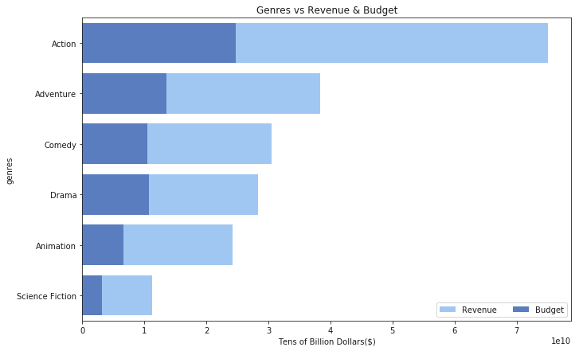


# Chart by Month of Release and Bar Plot


```python
mo = movdat_df.groupby('release_month').sum()
mo = mo.drop(columns=['vote_average', 'roi'])
moroi = pd.DataFrame((mo['revenue']/mo['budget']-1),columns=['roi'])
mo = pd.merge(mo,moroi, how='outer',left_index=True,right_index=True)
mo = mo.reset_index()
mo2 = movdat_df.groupby('release_month').mean()
mo2 = mo2.drop(columns=['budget', 'revenue','award_noms','roi'])
mo2 = mo2.reset_index()
mo3 = pd.merge(mo,mo2)
mo3 = mo3[['release_month','revenue','budget','award_noms','vote_average','roi']]
mo3 = mo3.sort_values(['roi'], ascending=False)
mo3.style.format({'revenue': "${:,.0f}", 'budget': '${:,.0f}', 'roi': '{:.0%}', 'vote_average': '{:.1f}'})
```


<style  type="text/css" >
</style>  
<table id="T_5725e6e4_3b8f_11e8_9cc4_3ca067dc5c7c" > 
<thead>    <tr> 
        <th class="blank level0" ></th> 
        <th class="col_heading level0 col0" >release_month</th> 
        <th class="col_heading level0 col1" >revenue</th> 
        <th class="col_heading level0 col2" >budget</th> 
        <th class="col_heading level0 col3" >award_noms</th> 
        <th class="col_heading level0 col4" >vote_average</th> 
        <th class="col_heading level0 col5" >roi</th> 
    </tr></thead> 
<tbody>    <tr> 
        <th id="T_5725e6e4_3b8f_11e8_9cc4_3ca067dc5c7clevel0_row0" class="row_heading level0 row0" >6</th> 
        <td id="T_5725e6e4_3b8f_11e8_9cc4_3ca067dc5c7crow0_col0" class="data row0 col0" >June</td> 
        <td id="T_5725e6e4_3b8f_11e8_9cc4_3ca067dc5c7crow0_col1" class="data row0 col1" >$37,458,553,218</td> 
        <td id="T_5725e6e4_3b8f_11e8_9cc4_3ca067dc5c7crow0_col2" class="data row0 col2" >$10,053,027,964</td> 
        <td id="T_5725e6e4_3b8f_11e8_9cc4_3ca067dc5c7crow0_col3" class="data row0 col3" >20</td> 
        <td id="T_5725e6e4_3b8f_11e8_9cc4_3ca067dc5c7crow0_col4" class="data row0 col4" >6.3</td> 
        <td id="T_5725e6e4_3b8f_11e8_9cc4_3ca067dc5c7crow0_col5" class="data row0 col5" >273%</td> 
    </tr>    <tr> 
        <th id="T_5725e6e4_3b8f_11e8_9cc4_3ca067dc5c7clevel0_row1" class="row_heading level0 row1" >2</th> 
        <td id="T_5725e6e4_3b8f_11e8_9cc4_3ca067dc5c7crow1_col0" class="data row1 col0" >December</td> 
        <td id="T_5725e6e4_3b8f_11e8_9cc4_3ca067dc5c7crow1_col1" class="data row1 col1" >$29,682,127,801</td> 
        <td id="T_5725e6e4_3b8f_11e8_9cc4_3ca067dc5c7crow1_col2" class="data row1 col2" >$9,099,080,528</td> 
        <td id="T_5725e6e4_3b8f_11e8_9cc4_3ca067dc5c7crow1_col3" class="data row1 col3" >101</td> 
        <td id="T_5725e6e4_3b8f_11e8_9cc4_3ca067dc5c7crow1_col4" class="data row1 col4" >6.3</td> 
        <td id="T_5725e6e4_3b8f_11e8_9cc4_3ca067dc5c7crow1_col5" class="data row1 col5" >226%</td> 
    </tr>    <tr> 
        <th id="T_5725e6e4_3b8f_11e8_9cc4_3ca067dc5c7clevel0_row2" class="row_heading level0 row2" >0</th> 
        <td id="T_5725e6e4_3b8f_11e8_9cc4_3ca067dc5c7crow2_col0" class="data row2 col0" >April</td> 
        <td id="T_5725e6e4_3b8f_11e8_9cc4_3ca067dc5c7crow2_col1" class="data row2 col1" >$21,329,321,356</td> 
        <td id="T_5725e6e4_3b8f_11e8_9cc4_3ca067dc5c7crow2_col2" class="data row2 col2" >$6,582,837,936</td> 
        <td id="T_5725e6e4_3b8f_11e8_9cc4_3ca067dc5c7crow2_col3" class="data row2 col3" >2</td> 
        <td id="T_5725e6e4_3b8f_11e8_9cc4_3ca067dc5c7crow2_col4" class="data row2 col4" >6.1</td> 
        <td id="T_5725e6e4_3b8f_11e8_9cc4_3ca067dc5c7crow2_col5" class="data row2 col5" >224%</td> 
    </tr>    <tr> 
        <th id="T_5725e6e4_3b8f_11e8_9cc4_3ca067dc5c7clevel0_row3" class="row_heading level0 row3" >9</th> 
        <td id="T_5725e6e4_3b8f_11e8_9cc4_3ca067dc5c7crow3_col0" class="data row3 col0" >November</td> 
        <td id="T_5725e6e4_3b8f_11e8_9cc4_3ca067dc5c7crow3_col1" class="data row3 col1" >$22,418,144,562</td> 
        <td id="T_5725e6e4_3b8f_11e8_9cc4_3ca067dc5c7crow3_col2" class="data row3 col2" >$7,181,503,469</td> 
        <td id="T_5725e6e4_3b8f_11e8_9cc4_3ca067dc5c7crow3_col3" class="data row3 col3" >133</td> 
        <td id="T_5725e6e4_3b8f_11e8_9cc4_3ca067dc5c7crow3_col4" class="data row3 col4" >6.5</td> 
        <td id="T_5725e6e4_3b8f_11e8_9cc4_3ca067dc5c7crow3_col5" class="data row3 col5" >212%</td> 
    </tr>    <tr> 
        <th id="T_5725e6e4_3b8f_11e8_9cc4_3ca067dc5c7clevel0_row4" class="row_heading level0 row4" >5</th> 
        <td id="T_5725e6e4_3b8f_11e8_9cc4_3ca067dc5c7crow4_col0" class="data row4 col0" >July</td> 
        <td id="T_5725e6e4_3b8f_11e8_9cc4_3ca067dc5c7crow4_col1" class="data row4 col1" >$24,704,426,548</td> 
        <td id="T_5725e6e4_3b8f_11e8_9cc4_3ca067dc5c7crow4_col2" class="data row4 col2" >$8,080,515,448</td> 
        <td id="T_5725e6e4_3b8f_11e8_9cc4_3ca067dc5c7crow4_col3" class="data row4 col3" >32</td> 
        <td id="T_5725e6e4_3b8f_11e8_9cc4_3ca067dc5c7crow4_col4" class="data row4 col4" >6.2</td> 
        <td id="T_5725e6e4_3b8f_11e8_9cc4_3ca067dc5c7crow4_col5" class="data row4 col5" >206%</td> 
    </tr>    <tr> 
        <th id="T_5725e6e4_3b8f_11e8_9cc4_3ca067dc5c7clevel0_row5" class="row_heading level0 row5" >8</th> 
        <td id="T_5725e6e4_3b8f_11e8_9cc4_3ca067dc5c7crow5_col0" class="data row5 col0" >May</td> 
        <td id="T_5725e6e4_3b8f_11e8_9cc4_3ca067dc5c7crow5_col1" class="data row5 col1" >$27,325,073,348</td> 
        <td id="T_5725e6e4_3b8f_11e8_9cc4_3ca067dc5c7crow5_col2" class="data row5 col2" >$9,387,618,741</td> 
        <td id="T_5725e6e4_3b8f_11e8_9cc4_3ca067dc5c7crow5_col3" class="data row5 col3" >46</td> 
        <td id="T_5725e6e4_3b8f_11e8_9cc4_3ca067dc5c7crow5_col4" class="data row5 col4" >6.4</td> 
        <td id="T_5725e6e4_3b8f_11e8_9cc4_3ca067dc5c7crow5_col5" class="data row5 col5" >191%</td> 
    </tr>    <tr> 
        <th id="T_5725e6e4_3b8f_11e8_9cc4_3ca067dc5c7clevel0_row6" class="row_heading level0 row6" >3</th> 
        <td id="T_5725e6e4_3b8f_11e8_9cc4_3ca067dc5c7crow6_col0" class="data row6 col0" >February</td> 
        <td id="T_5725e6e4_3b8f_11e8_9cc4_3ca067dc5c7crow6_col1" class="data row6 col1" >$15,577,154,469</td> 
        <td id="T_5725e6e4_3b8f_11e8_9cc4_3ca067dc5c7crow6_col2" class="data row6 col2" >$5,556,232,967</td> 
        <td id="T_5725e6e4_3b8f_11e8_9cc4_3ca067dc5c7crow6_col3" class="data row6 col3" >19</td> 
        <td id="T_5725e6e4_3b8f_11e8_9cc4_3ca067dc5c7crow6_col4" class="data row6 col4" >6.2</td> 
        <td id="T_5725e6e4_3b8f_11e8_9cc4_3ca067dc5c7crow6_col5" class="data row6 col5" >180%</td> 
    </tr>    <tr> 
        <th id="T_5725e6e4_3b8f_11e8_9cc4_3ca067dc5c7clevel0_row7" class="row_heading level0 row7" >7</th> 
        <td id="T_5725e6e4_3b8f_11e8_9cc4_3ca067dc5c7crow7_col0" class="data row7 col0" >March</td> 
        <td id="T_5725e6e4_3b8f_11e8_9cc4_3ca067dc5c7crow7_col1" class="data row7 col1" >$21,226,776,059</td> 
        <td id="T_5725e6e4_3b8f_11e8_9cc4_3ca067dc5c7crow7_col2" class="data row7 col2" >$7,761,220,129</td> 
        <td id="T_5725e6e4_3b8f_11e8_9cc4_3ca067dc5c7crow7_col3" class="data row7 col3" >8</td> 
        <td id="T_5725e6e4_3b8f_11e8_9cc4_3ca067dc5c7crow7_col4" class="data row7 col4" >6.2</td> 
        <td id="T_5725e6e4_3b8f_11e8_9cc4_3ca067dc5c7crow7_col5" class="data row7 col5" >173%</td> 
    </tr>    <tr> 
        <th id="T_5725e6e4_3b8f_11e8_9cc4_3ca067dc5c7clevel0_row8" class="row_heading level0 row8" >10</th> 
        <td id="T_5725e6e4_3b8f_11e8_9cc4_3ca067dc5c7crow8_col0" class="data row8 col0" >October</td> 
        <td id="T_5725e6e4_3b8f_11e8_9cc4_3ca067dc5c7crow8_col1" class="data row8 col1" >$17,881,531,302</td> 
        <td id="T_5725e6e4_3b8f_11e8_9cc4_3ca067dc5c7crow8_col2" class="data row8 col2" >$6,603,895,033</td> 
        <td id="T_5725e6e4_3b8f_11e8_9cc4_3ca067dc5c7crow8_col3" class="data row8 col3" >65</td> 
        <td id="T_5725e6e4_3b8f_11e8_9cc4_3ca067dc5c7crow8_col4" class="data row8 col4" >6.3</td> 
        <td id="T_5725e6e4_3b8f_11e8_9cc4_3ca067dc5c7crow8_col5" class="data row8 col5" >171%</td> 
    </tr>    <tr> 
        <th id="T_5725e6e4_3b8f_11e8_9cc4_3ca067dc5c7clevel0_row9" class="row_heading level0 row9" >1</th> 
        <td id="T_5725e6e4_3b8f_11e8_9cc4_3ca067dc5c7crow9_col0" class="data row9 col0" >August</td> 
        <td id="T_5725e6e4_3b8f_11e8_9cc4_3ca067dc5c7crow9_col1" class="data row9 col1" >$14,567,168,524</td> 
        <td id="T_5725e6e4_3b8f_11e8_9cc4_3ca067dc5c7crow9_col2" class="data row9 col2" >$5,817,958,457</td> 
        <td id="T_5725e6e4_3b8f_11e8_9cc4_3ca067dc5c7crow9_col3" class="data row9 col3" >34</td> 
        <td id="T_5725e6e4_3b8f_11e8_9cc4_3ca067dc5c7crow9_col4" class="data row9 col4" >6.1</td> 
        <td id="T_5725e6e4_3b8f_11e8_9cc4_3ca067dc5c7crow9_col5" class="data row9 col5" >150%</td> 
    </tr>    <tr> 
        <th id="T_5725e6e4_3b8f_11e8_9cc4_3ca067dc5c7clevel0_row10" class="row_heading level0 row10" >11</th> 
        <td id="T_5725e6e4_3b8f_11e8_9cc4_3ca067dc5c7crow10_col0" class="data row10 col0" >September</td> 
        <td id="T_5725e6e4_3b8f_11e8_9cc4_3ca067dc5c7crow10_col1" class="data row10 col1" >$15,265,393,820</td> 
        <td id="T_5725e6e4_3b8f_11e8_9cc4_3ca067dc5c7crow10_col2" class="data row10 col2" >$6,268,147,108</td> 
        <td id="T_5725e6e4_3b8f_11e8_9cc4_3ca067dc5c7crow10_col3" class="data row10 col3" >59</td> 
        <td id="T_5725e6e4_3b8f_11e8_9cc4_3ca067dc5c7crow10_col4" class="data row10 col4" >6.2</td> 
        <td id="T_5725e6e4_3b8f_11e8_9cc4_3ca067dc5c7crow10_col5" class="data row10 col5" >144%</td> 
    </tr>    <tr> 
        <th id="T_5725e6e4_3b8f_11e8_9cc4_3ca067dc5c7clevel0_row11" class="row_heading level0 row11" >4</th> 
        <td id="T_5725e6e4_3b8f_11e8_9cc4_3ca067dc5c7crow11_col0" class="data row11 col0" >January</td> 
        <td id="T_5725e6e4_3b8f_11e8_9cc4_3ca067dc5c7crow11_col1" class="data row11 col1" >$9,969,052,578</td> 
        <td id="T_5725e6e4_3b8f_11e8_9cc4_3ca067dc5c7crow11_col2" class="data row11 col2" >$4,161,771,158</td> 
        <td id="T_5725e6e4_3b8f_11e8_9cc4_3ca067dc5c7crow11_col3" class="data row11 col3" >2</td> 
        <td id="T_5725e6e4_3b8f_11e8_9cc4_3ca067dc5c7crow11_col4" class="data row11 col4" >5.9</td> 
        <td id="T_5725e6e4_3b8f_11e8_9cc4_3ca067dc5c7crow11_col5" class="data row11 col5" >140%</td> 
    </tr></tbody> 
</table> 


```python
plt.subplots(figsize=(11, 7))
sns.set_color_codes("muted")
sns.barplot(x="revenue", y="release_month", data=mo3,label="Revenue", color="g")
sns.set_color_codes("deep")
sns.barplot(x="budget", y="release_month", data=mo3,label="Budget", color="g")
plt.legend(ncol=2, loc="lower right", frameon=True)
plt.xlabel("Tens of Billion Dollars($)")
plt.title("Release Month vs Revenue & Budget")
plt.savefig("Release Month Bar Plot")
plt.show()
```


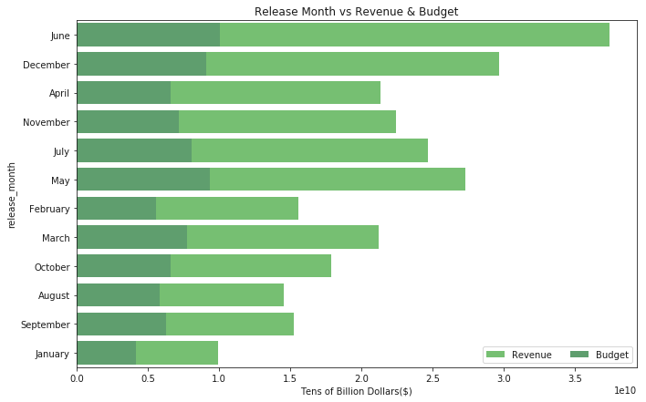


# Correlation matrix


```python
movdat_df.corr()
```


<div>
<style scoped>
    .dataframe tbody tr th:only-of-type {
        vertical-align: middle;
    }

    .dataframe tbody tr th {
        vertical-align: top;
    }

    .dataframe thead th {
        text-align: right;
    }
</style>
<table border="1" class="dataframe">
  <thead>
    <tr style="text-align: right;">
      <th></th>
      <th>revenue</th>
      <th>budget</th>
      <th>vote_average</th>
      <th>award_noms</th>
      <th>roi</th>
    </tr>
  </thead>
  <tbody>
    <tr>
      <th>revenue</th>
      <td>1.000000</td>
      <td>0.783859</td>
      <td>0.193535</td>
      <td>0.197553</td>
      <td>-0.006056</td>
    </tr>
    <tr>
      <th>budget</th>
      <td>0.783859</td>
      <td>1.000000</td>
      <td>0.074723</td>
      <td>0.094426</td>
      <td>-0.024073</td>
    </tr>
    <tr>
      <th>vote_average</th>
      <td>0.193535</td>
      <td>0.074723</td>
      <td>1.000000</td>
      <td>0.245995</td>
      <td>-0.027562</td>
    </tr>
    <tr>
      <th>award_noms</th>
      <td>0.197553</td>
      <td>0.094426</td>
      <td>0.245995</td>
      <td>1.000000</td>
      <td>-0.004273</td>
    </tr>
    <tr>
      <th>roi</th>
      <td>-0.006056</td>
      <td>-0.024073</td>
      <td>-0.027562</td>
      <td>-0.004273</td>
      <td>1.000000</td>
    </tr>
  </tbody>
</table>
</div>


```python
cmap = sns.diverging_palette(220, 10, as_cmap=True)
plt.subplots(figsize=(11, 7))
sns.heatmap(movdat_df.corr(),cmap=cmap,vmin=-0.1, center=0)
plt.title("Correlation Heatmap")
plt.savefig("Correlation Heatmap")
plt.show()
```


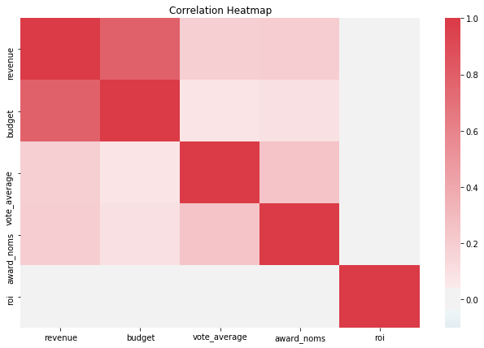


```python
movdat_df.corr()
```


<div>
<style scoped>
    .dataframe tbody tr th:only-of-type {
        vertical-align: middle;
    }

    .dataframe tbody tr th {
        vertical-align: top;
    }

    .dataframe thead th {
        text-align: right;
    }
</style>
<table border="1" class="dataframe">
  <thead>
    <tr style="text-align: right;">
      <th></th>
      <th>revenue</th>
      <th>budget</th>
      <th>vote_average</th>
      <th>award_noms</th>
      <th>roi</th>
    </tr>
  </thead>
  <tbody>
    <tr>
      <th>revenue</th>
      <td>1.000000</td>
      <td>0.783859</td>
      <td>0.193535</td>
      <td>0.197553</td>
      <td>-0.006056</td>
    </tr>
    <tr>
      <th>budget</th>
      <td>0.783859</td>
      <td>1.000000</td>
      <td>0.074723</td>
      <td>0.094426</td>
      <td>-0.024073</td>
    </tr>
    <tr>
      <th>vote_average</th>
      <td>0.193535</td>
      <td>0.074723</td>
      <td>1.000000</td>
      <td>0.245995</td>
      <td>-0.027562</td>
    </tr>
    <tr>
      <th>award_noms</th>
      <td>0.197553</td>
      <td>0.094426</td>
      <td>0.245995</td>
      <td>1.000000</td>
      <td>-0.004273</td>
    </tr>
    <tr>
      <th>roi</th>
      <td>-0.006056</td>
      <td>-0.024073</td>
      <td>-0.027562</td>
      <td>-0.004273</td>
      <td>1.000000</td>
    </tr>
  </tbody>
</table>
</div>


```python
actmov = movdat_df.query("genres=='Action'")
actmov.corr()
```


<div>
<style scoped>
    .dataframe tbody tr th:only-of-type {
        vertical-align: middle;
    }

    .dataframe tbody tr th {
        vertical-align: top;
    }

    .dataframe thead th {
        text-align: right;
    }
</style>
<table border="1" class="dataframe">
  <thead>
    <tr style="text-align: right;">
      <th></th>
      <th>revenue</th>
      <th>budget</th>
      <th>vote_average</th>
      <th>award_noms</th>
      <th>roi</th>
    </tr>
  </thead>
  <tbody>
    <tr>
      <th>revenue</th>
      <td>1.000000</td>
      <td>0.775657</td>
      <td>0.333995</td>
      <td>0.352148</td>
      <td>-0.016927</td>
    </tr>
    <tr>
      <th>budget</th>
      <td>0.775657</td>
      <td>1.000000</td>
      <td>0.220649</td>
      <td>0.195279</td>
      <td>-0.043746</td>
    </tr>
    <tr>
      <th>vote_average</th>
      <td>0.333995</td>
      <td>0.220649</td>
      <td>1.000000</td>
      <td>0.184407</td>
      <td>0.092701</td>
    </tr>
    <tr>
      <th>award_noms</th>
      <td>0.352148</td>
      <td>0.195279</td>
      <td>0.184407</td>
      <td>1.000000</td>
      <td>-0.002326</td>
    </tr>
    <tr>
      <th>roi</th>
      <td>-0.016927</td>
      <td>-0.043746</td>
      <td>0.092701</td>
      <td>-0.002326</td>
      <td>1.000000</td>
    </tr>
  </tbody>
</table>
</div>


```python
dramov = movdat_df.query("genres=='Drama'")
dramov.corr()
```


<div>
<style scoped>
    .dataframe tbody tr th:only-of-type {
        vertical-align: middle;
    }

    .dataframe tbody tr th {
        vertical-align: top;
    }

    .dataframe thead th {
        text-align: right;
    }
</style>
<table border="1" class="dataframe">
  <thead>
    <tr style="text-align: right;">
      <th></th>
      <th>revenue</th>
      <th>budget</th>
      <th>vote_average</th>
      <th>award_noms</th>
      <th>roi</th>
    </tr>
  </thead>
  <tbody>
    <tr>
      <th>revenue</th>
      <td>1.000000</td>
      <td>0.704408</td>
      <td>0.261886</td>
      <td>0.360416</td>
      <td>0.141592</td>
    </tr>
    <tr>
      <th>budget</th>
      <td>0.704408</td>
      <td>1.000000</td>
      <td>0.078533</td>
      <td>0.117167</td>
      <td>-0.085324</td>
    </tr>
    <tr>
      <th>vote_average</th>
      <td>0.261886</td>
      <td>0.078533</td>
      <td>1.000000</td>
      <td>0.296729</td>
      <td>0.175056</td>
    </tr>
    <tr>
      <th>award_noms</th>
      <td>0.360416</td>
      <td>0.117167</td>
      <td>0.296729</td>
      <td>1.000000</td>
      <td>0.123833</td>
    </tr>
    <tr>
      <th>roi</th>
      <td>0.141592</td>
      <td>-0.085324</td>
      <td>0.175056</td>
      <td>0.123833</td>
      <td>1.000000</td>
    </tr>
  </tbody>
</table>
</div>


```python
actdram = [actmov, dramov]
twogenre= pd.concat(actdram)
sns.lmplot(x="budget", y="revenue", hue="genres",size=6, data=twogenre);
```


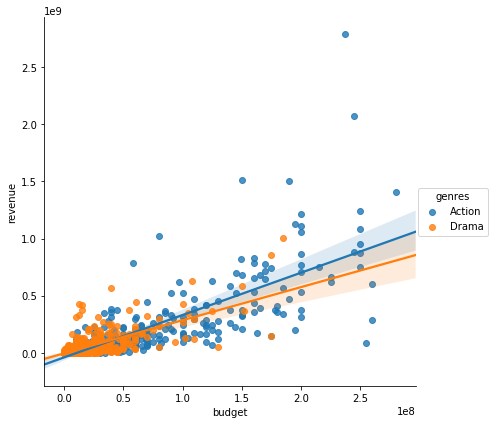


```python
sns.pairplot(twogenre, x_vars=["vote_average", "award_noms"], hue="genres", y_vars=["revenue"],
             size=6, aspect=.8, kind="reg");
```


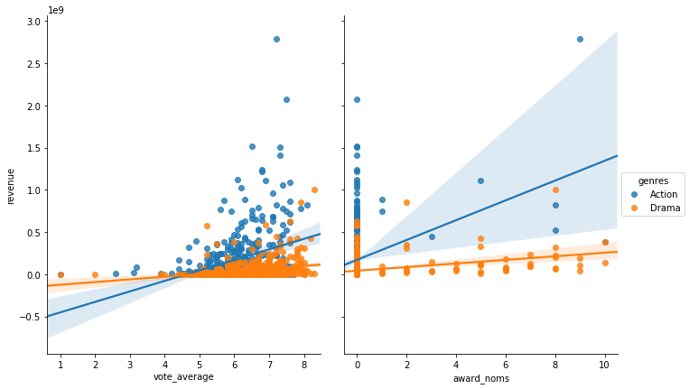


```python
junemov = movdat_df.query("release_month=='June'")
junemov.corr()
```


<div>
<style scoped>
    .dataframe tbody tr th:only-of-type {
        vertical-align: middle;
    }

    .dataframe tbody tr th {
        vertical-align: top;
    }

    .dataframe thead th {
        text-align: right;
    }
</style>
<table border="1" class="dataframe">
  <thead>
    <tr style="text-align: right;">
      <th></th>
      <th>revenue</th>
      <th>budget</th>
      <th>vote_average</th>
      <th>award_noms</th>
      <th>roi</th>
    </tr>
  </thead>
  <tbody>
    <tr>
      <th>revenue</th>
      <td>1.000000</td>
      <td>0.737119</td>
      <td>0.156925</td>
      <td>0.168653</td>
      <td>0.381141</td>
    </tr>
    <tr>
      <th>budget</th>
      <td>0.737119</td>
      <td>1.000000</td>
      <td>-0.029203</td>
      <td>0.136053</td>
      <td>-0.016479</td>
    </tr>
    <tr>
      <th>vote_average</th>
      <td>0.156925</td>
      <td>-0.029203</td>
      <td>1.000000</td>
      <td>0.239110</td>
      <td>0.214405</td>
    </tr>
    <tr>
      <th>award_noms</th>
      <td>0.168653</td>
      <td>0.136053</td>
      <td>0.239110</td>
      <td>1.000000</td>
      <td>0.102716</td>
    </tr>
    <tr>
      <th>roi</th>
      <td>0.381141</td>
      <td>-0.016479</td>
      <td>0.214405</td>
      <td>0.102716</td>
      <td>1.000000</td>
    </tr>
  </tbody>
</table>
</div>


```python
decmov = movdat_df.query("release_month=='December'")
decmov.corr()
```


<div>
<style scoped>
    .dataframe tbody tr th:only-of-type {
        vertical-align: middle;
    }

    .dataframe tbody tr th {
        vertical-align: top;
    }

    .dataframe thead th {
        text-align: right;
    }
</style>
<table border="1" class="dataframe">
  <thead>
    <tr style="text-align: right;">
      <th></th>
      <th>revenue</th>
      <th>budget</th>
      <th>vote_average</th>
      <th>award_noms</th>
      <th>roi</th>
    </tr>
  </thead>
  <tbody>
    <tr>
      <th>revenue</th>
      <td>1.000000</td>
      <td>0.737371</td>
      <td>0.224114</td>
      <td>0.317259</td>
      <td>-0.027718</td>
    </tr>
    <tr>
      <th>budget</th>
      <td>0.737371</td>
      <td>1.000000</td>
      <td>0.055310</td>
      <td>0.128229</td>
      <td>-0.073586</td>
    </tr>
    <tr>
      <th>vote_average</th>
      <td>0.224114</td>
      <td>0.055310</td>
      <td>1.000000</td>
      <td>0.321827</td>
      <td>0.102825</td>
    </tr>
    <tr>
      <th>award_noms</th>
      <td>0.317259</td>
      <td>0.128229</td>
      <td>0.321827</td>
      <td>1.000000</td>
      <td>-0.016715</td>
    </tr>
    <tr>
      <th>roi</th>
      <td>-0.027718</td>
      <td>-0.073586</td>
      <td>0.102825</td>
      <td>-0.016715</td>
      <td>1.000000</td>
    </tr>
  </tbody>
</table>
</div>


```python
jundec = [junemov, decmov]
twomonth= pd.concat(jundec)
sns.lmplot(x="budget", y="revenue", hue="release_month", size=6, data=twomonth);
```


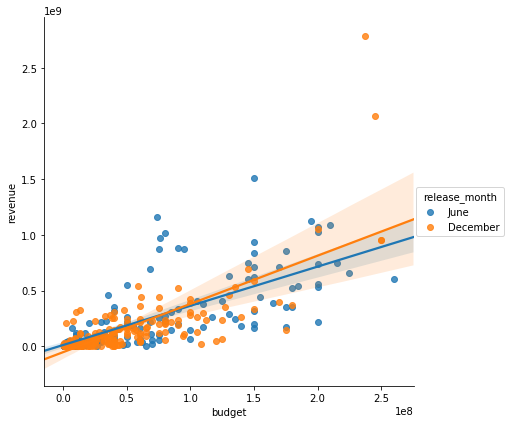


```python
sns.pairplot(twomonth, x_vars=["vote_average", "award_noms"], hue="release_month", y_vars=["revenue"],
             size=6, aspect=.8, kind="reg");
```


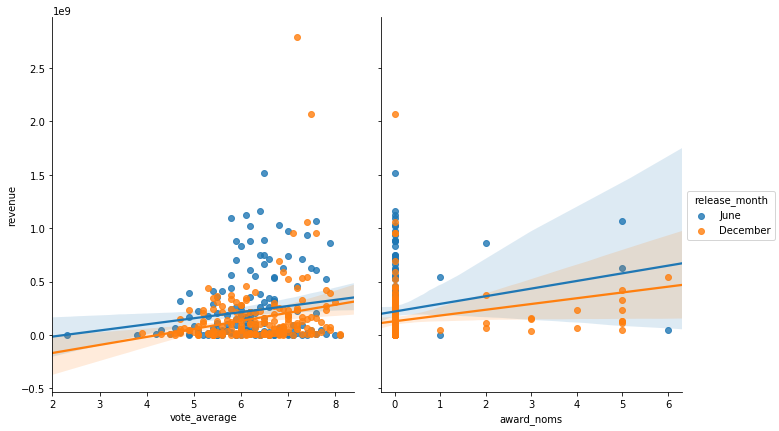


#Scatter plots


```python
sns.jointplot('budget','revenue',data=movdat_df,kind="reg")

```


    <seaborn.axisgrid.JointGrid at 0x2208ea86c88>


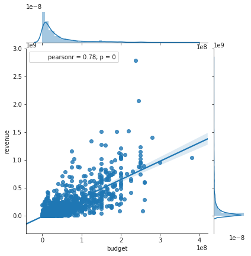


```python
sns.jointplot('vote_average','revenue',data=movdat_df,kind="reg")
```


    <seaborn.axisgrid.JointGrid at 0x2208ecd0828>


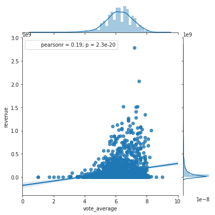


```python
sns.jointplot('award_noms','revenue',data=movdat_df,kind="reg")
```


    <seaborn.axisgrid.JointGrid at 0x2208ec90390>


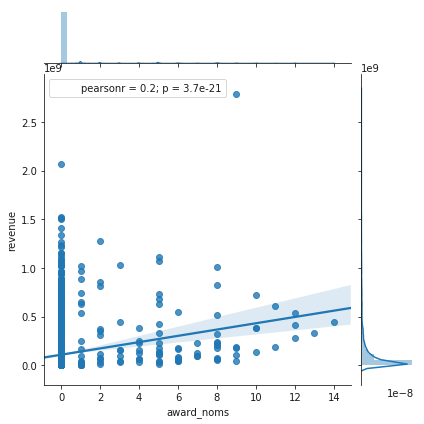


```python
sns.distplot(movdat_df['revenue'])
```


    <matplotlib.axes._subplots.AxesSubplot at 0x1c9bab26f98>


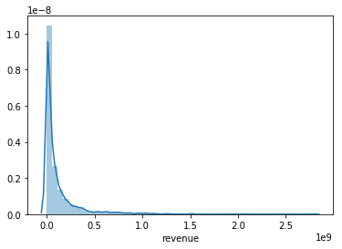


```python
sns.distplot(movdat_df['budget'])
```


    <matplotlib.axes._subplots.AxesSubplot at 0x1c9b99704a8>


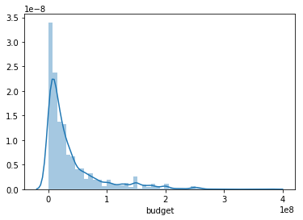

